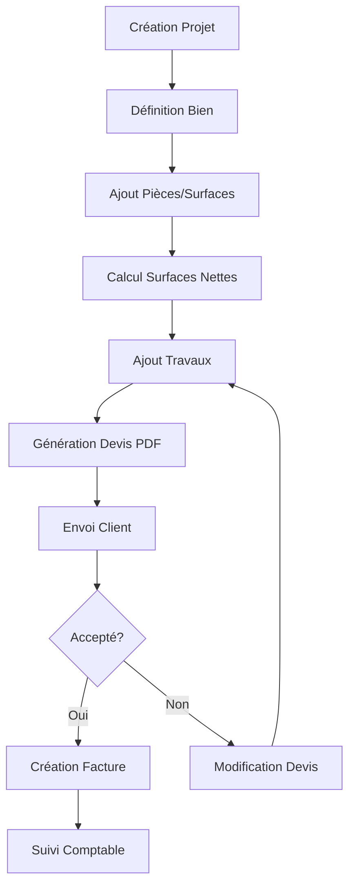
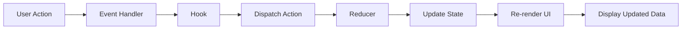
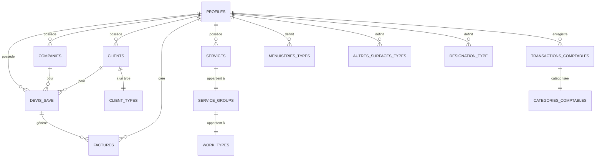

# Documentation Complète - BâtiPilot IAssist

**Version:** 1.0  
**Date:** 27 Octobre 2025  
**Auteur:** Documentation Technique Complète

---

## Table des Matières

### PARTIE I - PRÉSENTATION GÉNÉRALE
1. [Introduction et Vision du Projet](#1-introduction-et-vision-du-projet)
2. [Architecture Globale](#2-architecture-globale)
3. [Stack Technique et Dépendances](#3-stack-technique-et-dépendances)

### PARTIE II - ARCHITECTURE DES DONNÉES
4. [Schéma de Base de Données](#4-schéma-de-base-de-données)
5. [Types et Énumérations](#5-types-et-énumérations)
6. [Flux de Données et State Management](#6-flux-de-données-et-state-management)

### PARTIE III - MODULES FONCTIONNELS
7. [Module Projet et Devis](#7-module-projet-et-devis)
8. [Module Bien - Gestion des Surfaces](#8-module-bien---gestion-des-surfaces)
9. [Module Travaux et Services](#9-module-travaux-et-services)
10. [Module Récapitulatif](#10-module-récapitulatif)
11. [Module Facturation](#11-module-facturation)
12. [Module Comptabilité](#12-module-comptabilité)

### PARTIE IV - FONCTIONNALITÉS TRANSVERSALES
13. [Génération de PDF](#13-génération-de-pdf)
14. [Import et Export de Données](#14-import-et-export-de-données)
15. [Assistant IA et Automatisation](#15-assistant-ia-et-automatisation)
16. [Gestion des Utilisateurs et Permissions](#16-gestion-des-utilisateurs-et-permissions)

### PARTIE V - GUIDE DE DÉVELOPPEMENT
17. [Hooks Personnalisés](#17-hooks-personnalisés)
18. [Composants Clés](#18-composants-clés)
19. [Services et Utilitaires](#19-services-et-utilitaires)
20. [Bonnes Pratiques et Conventions](#20-bonnes-pratiques-et-conventions)

---

# PARTIE I - PRÉSENTATION GÉNÉRALE

## 1. Introduction et Vision du Projet

### 1.1 Qu'est-ce que BâtiPilot IAssist ?

**BâtiPilot IAssist** est une application web complète de gestion de devis et de facturation spécialement conçue pour les professionnels du bâtiment. Elle permet de :

- **Créer des devis détaillés** avec calcul automatique des surfaces
- **Gérer des projets** de rénovation ou construction
- **Générer des factures** à partir des devis (factures d'acompte, de situation, de solde)
- **Suivre la comptabilité** avec catégorisation automatique des transactions
- **Produire des PDF professionnels** personnalisables (devis, factures)
- **Importer des données** depuis des fichiers CSV ou PDF
- **Bénéficier d'un assistant IA** pour faciliter la saisie et l'analyse

### 1.2 Objectifs Principaux

1. **Gain de temps** : Automatisation des calculs de surfaces, génération rapide de documents
2. **Précision** : Calculs exacts des surfaces nettes (déduction menuiseries, ouvertures)
3. **Professionnalisme** : Documents PDF personnalisables et conformes
4. **Traçabilité** : Historique complet des devis, factures et transactions
5. **Intelligence** : Suggestions automatiques, reconnaissance de clients, catégorisation

### 1.3 Utilisateurs Cibles

- **Artisans du bâtiment** (peintres, électriciens, plombiers, etc.)
- **Entreprises de rénovation** (TPE/PME)
- **Gestionnaires de chantiers**
- **Auto-entrepreneurs** dans le BTP

### 1.4 Workflow Général



---

## 2. Architecture Globale

### 2.1 Architecture en Couches

BâtiPilot IAssist suit une architecture en couches stricte pour assurer la séparation des responsabilités :

```
┌─────────────────────────────────────────────┐
│           COUCHE PRÉSENTATION               │
│   (Pages, Composants UI, Layout)            │
│   - src/pages/                              │
│   - src/components/                         │
└─────────────────────────────────────────────┘
                    ↓
┌─────────────────────────────────────────────┐
│         COUCHE LOGIQUE MÉTIER               │
│   (Hooks, Reducers, Business Logic)         │
│   - src/hooks/                              │
│   - src/features/*/hooks/                   │
│   - src/features/project/reducers/          │
└─────────────────────────────────────────────┘
                    ↓
┌─────────────────────────────────────────────┐
│         COUCHE SERVICES                     │
│   (API, Formatage, PDF, Calculs)            │
│   - src/services/                           │
│   - src/utils/                              │
└─────────────────────────────────────────────┘
                    ↓
┌─────────────────────────────────────────────┐
│         COUCHE DONNÉES                      │
│   (Supabase, Context, LocalStorage)         │
│   - src/contexts/                           │
│   - src/integrations/supabase/              │
└─────────────────────────────────────────────┘
```

### 2.2 Principe de Séparation des Responsabilités

#### 2.2.1 Composants UI (Présentation)
- **Responsabilité** : Affichage uniquement
- **Pas de logique métier** directement dans les composants
- Utilisation de hooks pour accéder aux données et actions
- **Exemple** :
```tsx
// src/pages/Bien.tsx
export default function Bien() {
  const { projectState, dispatch } = useProject();
  const { calculatedValues } = useCalculatedValues(selectedDesignation);
  const handlers = useDesignationHandlers();
  
  return (
    <div>
      <PropertyForm />
      <DesignationList />
    </div>
  );
}
```

#### 2.2.2 Hooks (Logique Métier)
- **Responsabilité** : Encapsuler la logique métier
- Gestion de l'état local
- Calculs et transformations
- **Exemple** :
```tsx
// src/hooks/useCalculatedValues.tsx
export const useCalculatedValues = (designation: Designation) => {
  const [values, setValues] = useState<CalculatedValues | null>(null);
  
  useEffect(() => {
    const calculated = {
      surfaceSolNette: calculerSurfacesNettes(designation).surfaceSolNette,
      surfaceMuraleNette: calculerSurfacesNettes(designation).surfaceMuraleNette,
      // ... autres calculs
    };
    setValues(calculated);
  }, [designation]);
  
  return values;
};
```

#### 2.2.3 Services (Accès Données)
- **Responsabilité** : Communication avec l'API, formatage
- Pas d'accès direct depuis les composants
- Utilisés uniquement par les hooks
- **Exemple** :
```tsx
// src/services/projectSaveService.ts
export async function saveProject(projectState: ProjectState): Promise<void> {
  const { data, error } = await supabase
    .from('devis_save')
    .upsert({
      id: projectState.id,
      project_data: projectState.project_data,
      // ...
    });
  
  if (error) throw error;
}
```

### 2.3 Flux de Données Unidirectionnel



**Principe clé** : Les données circulent toujours dans le même sens. Jamais de modification directe du state depuis un composant.

### 2.4 Architecture Modulaire (Features)

L'application est organisée en **modules fonctionnels** indépendants :

```
src/
├── features/
│   ├── invoicing/          # Module Facturation
│   │   ├── components/
│   │   ├── hooks/
│   │   └── types/
│   ├── project/            # Module Projet
│   │   └── reducers/
│   └── ...
```

Chaque module contient :
- Ses **composants** spécifiques
- Ses **hooks** métier
- Ses **types** TypeScript
- Ses **services** si nécessaire

---

## 3. Stack Technique et Dépendances

### 3.1 Framework et Outils Principaux

| Technologie | Version | Usage |
|------------|---------|-------|
| **React** | 18.3.1 | Framework UI |
| **TypeScript** | 5.x | Typage statique |
| **Vite** | 5.x | Build tool rapide |
| **Tailwind CSS** | 3.x | Framework CSS utilitaire |
| **React Router** | 6.26.2 | Routing |

### 3.2 Backend et Base de Données

| Technologie | Usage |
|------------|-------|
| **Supabase** | Backend as a Service (BaaS) |
| **PostgreSQL** | Base de données relationnelle |
| **Row Level Security (RLS)** | Sécurité au niveau ligne |
| **Edge Functions** | Fonctions serverless |

### 3.3 Bibliothèques UI et Composants

| Bibliothèque | Usage |
|-------------|-------|
| **ShadCN/UI** | Composants UI réutilisables |
| **Radix UI** | Composants accessibles headless |
| **Lucide React** | Icônes |
| **Recharts** | Graphiques et visualisations |
| **Sonner** | Notifications toast |

### 3.4 Génération de PDF

| Bibliothèque | Usage |
|-------------|-------|
| **@react-pdf/renderer** | Génération PDF côté client |
| **pdfjs-dist** | Lecture et parsing de PDF |

### 3.5 Traitement de Données

| Bibliothèque | Usage |
|-------------|-------|
| **PapaParse** | Parsing CSV |
| **date-fns** | Manipulation de dates |
| **zod** | Validation de schémas |
| **react-hook-form** | Gestion de formulaires |

### 3.6 IA et NLP

| Bibliothèque | Usage |
|-------------|-------|
| **@google/generative-ai** | Gemini AI |
| **@google-cloud/local-auth** | Authentification Google Cloud |

### 3.7 Organisation du Code

```
batipilot-iassist/
├── src/
│   ├── app/                    # Configuration app (router)
│   ├── components/             # Composants réutilisables
│   │   ├── ui/                 # Composants ShadCN
│   │   ├── bien/               # Composants module Bien
│   │   ├── travaux/            # Composants module Travaux
│   │   ├── ai/                 # Composants IA
│   │   └── ...
│   ├── contexts/               # Contextes React
│   │   ├── ProjectContext.tsx
│   │   └── ReferenceDataContext.tsx
│   ├── features/               # Modules fonctionnels
│   │   ├── invoicing/          # Facturation
│   │   └── project/            # Projet
│   ├── hooks/                  # Hooks personnalisés
│   ├── pages/                  # Pages de l'application
│   ├── services/               # Services (API, PDF, etc.)
│   │   ├── pdf/
│   │   ├── invoice/
│   │   └── ...
│   ├── types/                  # Définitions de types
│   ├── utils/                  # Utilitaires
│   └── integrations/           # Intégrations externes
│       └── supabase/
├── supabase/
│   ├── functions/              # Edge Functions
│   └── migrations/             # Migrations SQL
├── public/                     # Assets statiques
└── documentation/              # Documentation détaillée
```

---

# PARTIE II - ARCHITECTURE DES DONNÉES

## 4. Schéma de Base de Données

### 4.1 Vue d'Ensemble des Tables

BâtiPilot utilise **Supabase** (PostgreSQL) avec les tables principales suivantes :



### 4.2 Table `devis_save` (Projets/Devis)

**Table centrale** stockant tous les projets et devis.

```sql
CREATE TABLE devis_save (
  id UUID PRIMARY KEY DEFAULT gen_random_uuid(),
  user_id UUID NOT NULL REFERENCES auth.users(id),
  company_id UUID NOT NULL REFERENCES companies(id),
  client_id UUID NOT NULL REFERENCES clients(id),
  
  -- Métadonnées du devis
  devis_number TEXT NOT NULL,
  devis_date DATE NOT NULL DEFAULT CURRENT_DATE,
  project_name TEXT NOT NULL,
  status devis_status_enum NOT NULL DEFAULT 'Brouillon',
  
  -- Données métier
  total_ht NUMERIC NOT NULL DEFAULT 0.00,
  project_data JSONB NOT NULL DEFAULT '{}'::jsonb,
  
  -- Suivi
  date_acceptation DATE,
  reference_bon_commande TEXT,
  
  -- Timestamps
  created_at TIMESTAMPTZ NOT NULL DEFAULT now(),
  updated_at TIMESTAMPTZ NOT NULL DEFAULT now()
);
```

#### 4.2.1 Structure de `project_data` (JSONB)

Le champ `project_data` contient toute la logique métier du projet :

```typescript
interface ProjectData {
  metadata: {
    adresseChantier: string | null;
    occupant: string | null;
    descriptionProjet: string | null;
    infoComplementaire: string | null;
    clientsData: ClientData | null;
    company: CompanyData | null;
  };
  
  property: {
    type: string | null;              // "Appartement", "Maison", etc.
    levelCount: number;                // Nombre d'étages
    totalArea: number;                 // Surface totale
    roomCount: number;                 // Nombre de pièces
    ceilingHeight: number;             // Hauteur sous plafond
    baseboardHeight: number;           // Hauteur des plinthes
  };
  
  designations: Designation[];         // Pièces/éléments
  travaux: Travail[];                  // Prestations de travaux
}
```

#### 4.2.2 Structure de `Designation` (Pièce)

Chaque désignation représente une pièce ou un élément du bien :

```typescript
interface Designation {
  id: string;                          // UUID unique
  name: string;                        // Ex: "Chambre 1"
  numero?: number;                     // Numéro séquentiel
  type?: string;                       // "Pièce", "Couloir", etc.
  
  // Dimensions brutes
  longueur: number | null;
  largeur: number | null;
  hauteur: number | null;
  profondeur: number | null;
  
  // Cases à cocher pour activer les calculs
  useLongueur: boolean;
  useLargeur: boolean;
  useHauteur: boolean;
  useProfondeur: boolean;
  useLineaire: boolean;
  usePlinthes: boolean;
  
  // Surfaces brutes calculées
  surfaceSol: number | null;
  surfacePlafond: number | null;
  surfaceMurale: number | null;
  surfaceGenerique: number | null;
  perimeter: number | null;
  lineairePlinthe: number | null;
  valeurLineaire: number | null;
  
  // Menuiseries (portes, fenêtres)
  menuiseries: MenuiserieInstance[];
  
  // Autres surfaces (ouvertures personnalisées)
  autresSurfaces: AutreSurfaceInstance[];
  
  // Surfaces nettes (après déductions)
  calculatedValues: {
    surfaceSolNette: number | null;
    surfacePlafondNette: number | null;
    surfaceMuraleNette: number | null;
    surfaceGeneriqueNette: number | null;
    lineairePlintheNet: number | null;
    surfacePlinthes: number | null;
    typeSurfaceGenerique: 'Sol' | 'Mur' | 'Plafond' | 'Autre';
  };
}
```

#### 4.2.3 Structure de `Travail` (Prestation)

Chaque travail représente une prestation à réaliser :

```typescript
interface Travail {
  id: string;
  designationId: string;               // ID de la pièce concernée
  
  // Service référencé
  serviceId: string;
  serviceName: string;
  serviceDescription: string;
  
  // Hiérarchie
  workTypeId: string;
  workTypeName: string;
  serviceGroupId: string;
  serviceGroupName: string;
  
  // Quantité et unité
  quantite: number;
  unit: UnitEnum;                      // "M²", "Ml", "Unité", etc.
  
  // Prix
  prixMainOeuvre: number;
  prixFourniture: number;
  tauxTVA: number;                     // En pourcentage
  
  // Totaux calculés
  totalMainOeuvreHT: number;
  totalFournitureHT: number;
  totalHT: number;
  totalTVA: number;
  totalTTC: number;
  
  // Détails
  titre: string;
  description: string;
  surfaceImpactee: TypeSurfaceEnum;    // "Mur", "Sol", "Plafond", etc.
  destinataire: string;                // "Pièce", "Menuiserie", etc.
  
  created_at: string;
}
```

### 4.3 Table `factures` (Factures)

```sql
CREATE TABLE factures (
  id UUID PRIMARY KEY DEFAULT gen_random_uuid(),
  user_id UUID NOT NULL REFERENCES auth.users(id),
  company_id UUID NOT NULL REFERENCES companies(id),
  client_id UUID NOT NULL REFERENCES clients(id),
  devis_id UUID NOT NULL REFERENCES devis_save(id),
  
  -- Numérotation
  numero_facture_annuel TEXT NOT NULL,       -- Ex: "2025-0001"
  numero_facture_mensuel TEXT NOT NULL,      -- Ex: "2025-01-0001"
  type_facture_projet facture_type_enum,     -- "Acompte", "Situation", "Solde"
  sequence_projet_numero INTEGER,            -- 1, 2, 3...
  
  -- Dates
  facture_date DATE NOT NULL DEFAULT CURRENT_DATE,
  devis_date_signature DATE,
  due_date DATE,
  encaissement_date DATE,
  
  -- Montants
  total_ht NUMERIC NOT NULL DEFAULT 0.00,
  total_tva NUMERIC NOT NULL DEFAULT 0.00,
  total_ttc NUMERIC NOT NULL DEFAULT 0.00,
  amount_paid NUMERIC NOT NULL DEFAULT 0.00,
  
  -- Statut et métadonnées
  status facture_status_type NOT NULL DEFAULT 'Non Transmise',
  objet_facture TEXT,
  payment_terms TEXT,
  notes_complementaires TEXT,
  notes_internes TEXT,
  devis_reference_commande TEXT,
  
  -- Données détaillées (JSONB)
  facture_data JSONB,
  
  -- Timestamps
  created_at TIMESTAMPTZ NOT NULL DEFAULT now(),
  updated_at TIMESTAMPTZ NOT NULL DEFAULT now()
);
```

#### 4.3.1 Structure de `facture_data` (JSONB)

```typescript
interface FactureData {
  // Informations générales reprises du devis
  devis: {
    id: string;
    numero: string;
    date: string;
    projectName: string;
    referenceCommande?: string;
  };
  
  // Lignes de facturation
  lignes: LigneFacture[];
  
  // Totaux par taux de TVA
  totauxParTVA: {
    [tauxTVA: string]: {
      totalHT: number;
      totalTVA: number;
      totalTTC: number;
    };
  };
  
  // Informations cumulées
  montantTotalDevisHT: number;
  montantDejaFactureHT: number;
  montantDejaFacturePourcentage: number;
  montantCumulFactureHT: number;
  montantCumulFacturePourcentage: number;
  
  // Métadonnées
  metadata?: {
    client: ClientData;
    company: CompanyData;
    project: ProjectMetadata;
  };
}

interface LigneFacture {
  travailId: string;
  designationName: string;
  titre: string;
  description: string;
  quantite: number;
  unit: string;
  
  // Montants du devis
  prixMainOeuvreHT: number;
  prixFournitureHT: number;
  totalHTDevis: number;
  
  // Pourcentages à facturer
  moPercentage: number;               // 0-100
  foPercentage: number;               // 0-100
  
  // Montants facturés
  moFactureHT: number;
  foFactureHT: number;
  totalHTFacture: number;
  tauxTVA: number;
  montantTVA: number;
  totalTTCFacture: number;
  
  // Déjà facturé (factures précédentes)
  moDejaFactureHT: number;
  foDejaFactureHT: number;
  totalDejaFactureHT: number;
  
  // Cumulé (y compris cette facture)
  moCumulFactureHT: number;
  foCumulFactureHT: number;
  totalCumulFactureHT: number;
  pourcentageCumulFacture: number;
}
```

### 4.4 Tables de Référence

#### 4.4.1 `companies` (Entreprises)

```sql
CREATE TABLE companies (
  id UUID PRIMARY KEY DEFAULT gen_random_uuid(),
  user_id UUID NOT NULL REFERENCES auth.users(id),
  
  -- Informations générales
  name TEXT NOT NULL,
  prenom TEXT,
  type TEXT,                            -- "SARL", "SAS", "Auto-entrepreneur"
  
  -- Contact
  email TEXT,
  tel1 TEXT,
  tel2 TEXT,
  address TEXT,
  postal_code TEXT,
  city TEXT,
  
  -- Informations légales
  siret TEXT,
  tva_intracom TEXT,
  code_ape TEXT,
  capital_social TEXT,
  rib TEXT,
  bic TEXT,
  
  -- Personnalisation
  logo_url TEXT,
  slogan TEXT,
  notes TEXT,
  
  created_at TIMESTAMPTZ NOT NULL DEFAULT now()
);
```

#### 4.4.2 `clients` (Clients)

```sql
CREATE TABLE clients (
  id UUID PRIMARY KEY DEFAULT gen_random_uuid(),
  user_id UUID NOT NULL REFERENCES auth.users(id),
  client_type_id UUID REFERENCES client_types(id),
  
  -- Identité
  nom TEXT NOT NULL,
  prenom TEXT,
  
  -- Contact
  email TEXT,
  tel1 TEXT,
  tel2 TEXT,
  
  -- Adresse
  adresse TEXT,
  code_postal TEXT,
  ville TEXT,
  
  -- Informations complémentaires
  autre_info TEXT,
  infos_complementaires TEXT,
  
  created_at TIMESTAMPTZ NOT NULL DEFAULT now()
);
```

#### 4.4.3 `services` (Prestations)

```sql
CREATE TABLE services (
  id UUID PRIMARY KEY DEFAULT gen_random_uuid(),
  user_id UUID NOT NULL REFERENCES auth.users(id),
  group_id UUID REFERENCES service_groups(id),
  
  -- Identification
  name TEXT NOT NULL,
  description TEXT,
  
  -- Tarification
  labor_price NUMERIC NOT NULL,          -- Prix main d'œuvre
  supply_price NUMERIC NOT NULL,         -- Prix fourniture
  unit unit_enum NOT NULL,               -- Unité
  
  -- Métadonnées
  surface_impactee type_surface_enum NOT NULL,
  last_update_date TEXT,
  
  created_at TIMESTAMPTZ NOT NULL DEFAULT now()
);
```

#### 4.4.4 `menuiseries_types` (Types de Menuiseries)

```sql
CREATE TABLE menuiseries_types (
  id UUID PRIMARY KEY DEFAULT gen_random_uuid(),
  user_id UUID NOT NULL REFERENCES auth.users(id),
  
  -- Identification
  name TEXT NOT NULL,                    -- Ex: "Porte standard"
  description TEXT,
  
  -- Dimensions
  largeur NUMERIC NOT NULL,
  hauteur NUMERIC NOT NULL,
  
  -- Impact
  surface_impactee type_surface_enum NOT NULL,
  impacte_plinthe BOOLEAN NOT NULL DEFAULT false,
  
  created_at TIMESTAMPTZ NOT NULL DEFAULT now()
);
```

#### 4.4.5 `autres_surfaces_types` (Types de Surfaces Personnalisées)

```sql
CREATE TABLE autres_surfaces_types (
  id UUID PRIMARY KEY DEFAULT gen_random_uuid(),
  user_id UUID NOT NULL REFERENCES auth.users(id),
  
  -- Identification
  name TEXT NOT NULL,                    -- Ex: "Ouverture cuisine"
  description TEXT,
  
  -- Dimensions
  largeur NUMERIC NOT NULL,
  hauteur NUMERIC NOT NULL,
  
  -- Impact
  surface_impactee type_surface_enum NOT NULL,
  adjustment_type adjustment_enum NOT NULL DEFAULT 'Déduire',
  impacte_plinthe BOOLEAN NOT NULL DEFAULT false,
  
  created_at TIMESTAMPTZ NOT NULL DEFAULT now()
);
```

### 4.5 Tables de Comptabilité

#### 4.5.1 `transactions_comptables`

```sql
CREATE TABLE transactions_comptables (
  id UUID PRIMARY KEY DEFAULT gen_random_uuid(),
  user_id UUID NOT NULL REFERENCES auth.users(id),
  company_id UUID NOT NULL REFERENCES companies(id),
  categorie_id UUID REFERENCES categories_comptables(id),
  
  -- Type et description
  type TEXT NOT NULL,                    -- "recette" ou "dépense"
  description TEXT NOT NULL,
  
  -- Montants
  montant NUMERIC NOT NULL,
  taux_tva NUMERIC DEFAULT 0.00,
  montant_tva NUMERIC DEFAULT 0.00,
  montant_ttc NUMERIC NOT NULL,
  
  -- Dates
  date_transaction DATE NOT NULL,
  date_valeur DATE,
  exercice_comptable INTEGER NOT NULL,
  
  -- Métadonnées
  moyen_paiement TEXT,
  numero_piece TEXT,
  reference_facture TEXT,
  tags TEXT[],
  justificatif_url TEXT,
  notes TEXT,
  
  -- Import CSV
  csv_import_id UUID,
  
  created_at TIMESTAMPTZ NOT NULL DEFAULT now(),
  updated_at TIMESTAMPTZ NOT NULL DEFAULT now()
);
```

#### 4.5.2 `categories_comptables`

```sql
CREATE TABLE categories_comptables (
  id UUID PRIMARY KEY DEFAULT gen_random_uuid(),
  
  -- Identification
  nom VARCHAR NOT NULL,
  description TEXT,
  type TEXT NOT NULL,                    -- "recette" ou "dépense"
  
  -- Paramètres
  taux_tva_defaut NUMERIC DEFAULT 20.00,
  
  created_at TIMESTAMPTZ NOT NULL DEFAULT now(),
  updated_at TIMESTAMPTZ NOT NULL DEFAULT now()
);
```

### 4.6 Tables IA et Assistant

#### 4.6.1 `ai_chats` (Conversations)

```sql
CREATE TABLE ai_chats (
  id UUID PRIMARY KEY DEFAULT gen_random_uuid(),
  user_id UUID NOT NULL REFERENCES auth.users(id),
  
  -- Métadonnées
  module_name TEXT NOT NULL DEFAULT 'rapports',
  title TEXT NOT NULL DEFAULT 'Nouvelle discussion',
  category TEXT,
  tags TEXT[] DEFAULT '{}',
  
  -- Configuration
  provider_name TEXT,
  model_name TEXT,
  system_prompt_snapshot TEXT,
  
  -- Statistiques
  message_count INTEGER DEFAULT 0,
  estimated_tokens INTEGER DEFAULT 0,
  estimated_cost NUMERIC DEFAULT 0,
  
  -- État
  is_archived BOOLEAN NOT NULL DEFAULT false,
  
  created_at TIMESTAMPTZ NOT NULL DEFAULT now(),
  updated_at TIMESTAMPTZ NOT NULL DEFAULT now()
);
```

#### 4.6.2 `ai_chat_messages` (Messages)

```sql
CREATE TABLE ai_chat_messages (
  id UUID PRIMARY KEY DEFAULT gen_random_uuid(),
  chat_id UUID NOT NULL REFERENCES ai_chats(id),
  
  -- Contenu
  role TEXT NOT NULL,                    -- "user" ou "assistant"
  content TEXT NOT NULL,
  
  created_at TIMESTAMPTZ NOT NULL DEFAULT now()
);
```

### 4.7 Politiques RLS (Row Level Security)

Toutes les tables ont des politiques RLS activées pour garantir la sécurité :

#### Exemple : Politique pour `devis_save`

```sql
-- Lecture : utilisateur voit ses propres projets OU admin voit tout
CREATE POLICY "Users can view their own projects"
  ON devis_save FOR SELECT
  USING (auth.uid() = user_id);

CREATE POLICY "Admins can view all projects"
  ON devis_save FOR SELECT
  USING (has_role(auth.uid(), 'admin'));

-- Création : utilisateur crée ses propres projets
CREATE POLICY "Users can create their own projects"
  ON devis_save FOR INSERT
  WITH CHECK (auth.uid() = user_id);

-- Mise à jour : utilisateur modifie ses propres projets
CREATE POLICY "Users can update their own projects"
  ON devis_save FOR UPDATE
  USING (auth.uid() = user_id);

-- Suppression : utilisateur supprime ses propres projets
CREATE POLICY "Users can delete their own projects"
  ON devis_save FOR DELETE
  USING (auth.uid() = user_id);
```

---

## 5. Types et Énumérations

### 5.1 Énumérations de Base de Données

Les énumérations sont définies au niveau PostgreSQL :

```sql
-- Statut des devis
CREATE TYPE devis_status_enum AS ENUM (
  'Brouillon',
  'Envoyé',
  'Accepté',
  'Refusé',
  'Archivé'
);

-- Unités de mesure
CREATE TYPE unit_enum AS ENUM (
  'M²',
  'Unité',
  'Ens.',
  'Ml',
  'M³',
  'Forfait'
);

-- Type de surface
CREATE TYPE type_surface_enum AS ENUM (
  'Mur',
  'Plafond',
  'Sol',
  'Aucune'
);

-- Type d'ajustement (autres surfaces)
CREATE TYPE adjustment_enum AS ENUM (
  'Ajouter',
  'Déduire'
);

-- Statut des factures
CREATE TYPE facture_status_type AS ENUM (
  'Non Transmise',
  'Transmise',
  'Partiellement Payée',
  'Totalement Payée',
  'En Retard',
  'Annulée'
);

-- Type de facture dans le projet
CREATE TYPE facture_type_enum AS ENUM (
  'Acompte',
  'Situation',
  'Solde'
);

-- Rôle utilisateur
CREATE TYPE app_role AS ENUM (
  'admin',
  'user'
);
```

### 5.2 Types TypeScript

#### 5.2.1 Types Projet (`src/types/project.ts`)

```typescript
export interface ProjectState {
  id?: string;
  user_id?: string;
  company_id?: string;
  client_id?: string;
  devis_number?: string;
  devis_date: string;
  project_name?: string;
  status: DevisStatusType;
  total_ht: number;
  project_data: ProjectData;
  isDirty: boolean;
  lastSaved?: string;
}

export interface ProjectData {
  metadata: ProjectMetadata;
  property: PropertyData;
  designations: Designation[];
  travaux: Travail[];
}

export interface ProjectMetadata {
  adresseChantier: string | null;
  occupant: string | null;
  descriptionProjet: string | null;
  infoComplementaire: string | null;
  clientsData: ClientData | null;
  company: CompanyData | null;
}

export interface PropertyData {
  type: string | null;
  levelCount: number;
  totalArea: number;
  roomCount: number;
  ceilingHeight: number;
  baseboardHeight: number;
}
```

#### 5.2.2 Types Facturation (`src/features/invoicing/types/`)

```typescript
export interface InvoiceHeader {
  numeroFacture: string;
  dateFacture: string;
  objetFacture: string;
  typeFacture: FactureTypeEnum | null;
  conditionsPaiement: string;
  dateEcheance: string | null;
  notesComplementaires: string;
}

export interface InvoiceLinePercentages {
  [travailId: string]: {
    moPercentage: number;
    foPercentage: number;
  };
}

export interface InvoiceTotals {
  totalHTGlobal: number;
  totalTVAGlobal: number;
  totalTTCGlobal: number;
  totauxParTauxTVA: {
    [tauxTVA: string]: {
      totalHT: number;
      totalTVA: number;
      totalTTC: number;
    };
  };
}
```

#### 5.2.3 Union Types pour Statuts

```typescript
// Statut devis (aligné avec l'ENUM PostgreSQL)
export type DevisStatusType = 
  | 'Brouillon'
  | 'Envoyé'
  | 'Accepté'
  | 'Refusé'
  | 'Archivé';

// Unité de mesure
export type UnitEnum = 
  | 'M²'
  | 'Unité'
  | 'Ens.'
  | 'Ml'
  | 'M³'
  | 'Forfait';

// Type de surface
export type TypeSurfaceEnum = 
  | 'Mur'
  | 'Plafond'
  | 'Sol'
  | 'Aucune';

// Type de facture
export type FactureTypeEnum = 
  | 'Acompte'
  | 'Situation'
  | 'Solde';

// Statut facture
export type FactureStatusType = 
  | 'Non Transmise'
  | 'Transmise'
  | 'Partiellement Payée'
  | 'Totalement Payée'
  | 'En Retard'
  | 'Annulée';
```

### 5.3 Interfaces de Calcul

```typescript
export interface CalculatedValues {
  surfaceSolNette: number | null;
  surfacePlafondNette: number | null;
  surfaceMuraleNette: number | null;
  surfaceGeneriqueNette: number | null;
  lineairePlintheNet: number | null;
  surfacePlinthes: number | null;
  typeSurfaceGenerique: 'Sol' | 'Mur' | 'Plafond' | 'Autre';
}

export interface MenuiserieInstance {
  id: string;
  menuiserieTypeId: string;
  quantite: number;
  nom?: string;
  largeur?: number;
  hauteur?: number;
  surfaceImpactee?: TypeSurfaceEnum;
  impactePlinthe?: boolean;
}

export interface AutreSurfaceInstance {
  id: string;
  autreSurfaceTypeId: string;
  quantite: number;
  nom?: string;
  largeur?: number;
  hauteur?: number;
  surfaceImpactee?: TypeSurfaceEnum;
  adjustmentType?: 'Ajouter' | 'Déduire';
  impactePlinthe?: boolean;
}
```


## Conclusion

Cette documentation couvre l'ensemble de l'architecture et des fonctionnalités de **BâtiPilot IAssist**. Pour toute question ou contribution, référez-vous aux fichiers de documentation dans `src/documentation/`.

**Ressources supplémentaires** :
- `CONTEXTE_ASSISTANT_DEVIS.md` : Guide IA
- `GUIDE_IMPORT_CSV_DEVIS_V4.md` : Guide import CSV
- `src/documentation/*.md` : Registres détaillés

**Version** : 1.0  
**Dernière mise à jour** : 27 Octobre 2025
