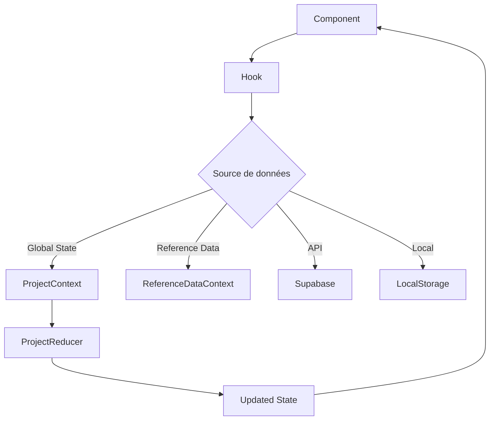
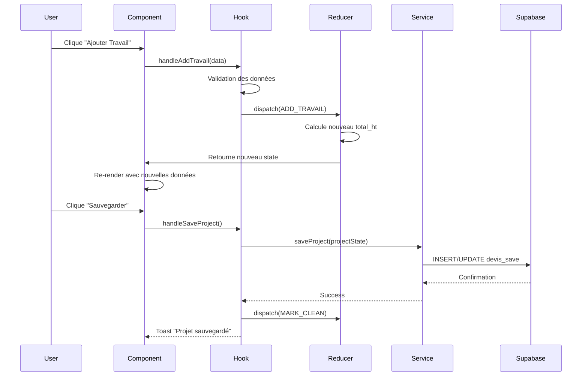
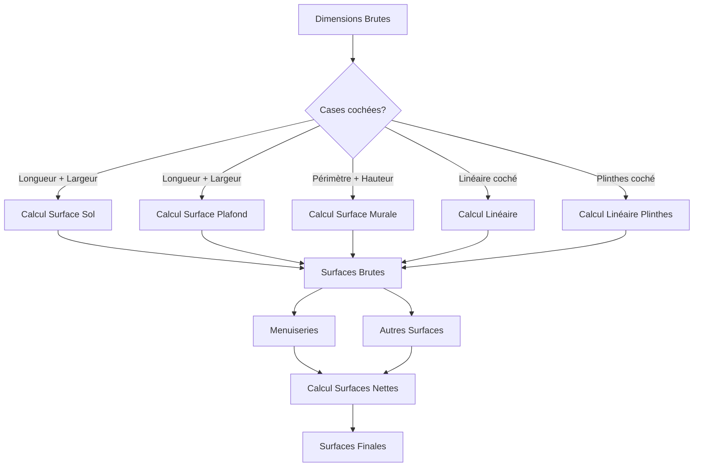
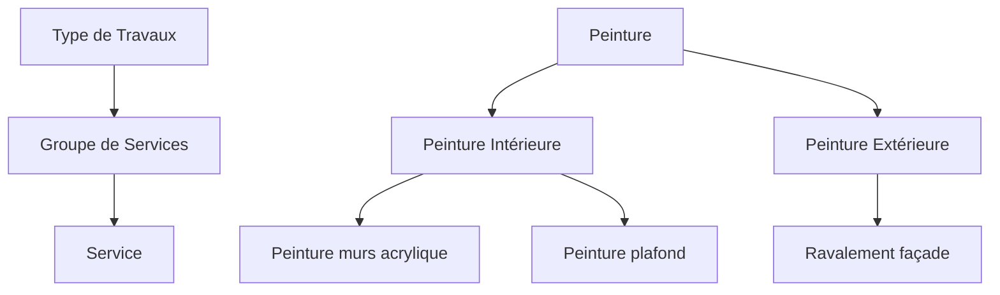

---

## 6. Flux de Données et State Management

### 6.1 Architecture du State Management

BâtiPilot utilise une combinaison de :
- **Context API** pour le state global
- **Reducers** pour les mutations complexes
- **Hooks personnalisés** pour encapsuler la logique
- **LocalStorage** pour la persistance temporaire



### 6.2 ProjectContext - State Global Principal

#### 6.2.1 Définition du Context

```tsx
// src/contexts/ProjectContext.tsx
import { createContext } from 'react';
import { ProjectState, ProjectAction } from '@/types/project';

interface ProjectContextValue {
  projectState: ProjectState;
  dispatch: React.Dispatch<ProjectAction>;
}

const ProjectContext = createContext<ProjectContextValue | undefined>(undefined);

export default ProjectContext;
```

#### 6.2.2 Provider

```tsx
// src/contexts/ProjectContext.tsx (suite)
export const ProjectProvider: React.FC<{ children: React.ReactNode }> = ({ children }) => {
  const [projectState, dispatch] = useReducer(projectReducer, initialProjectState);
  
  return (
    <ProjectContext.Provider value={{ projectState, dispatch }}>
      {children}
    </ProjectContext.Provider>
  );
};
```

#### 6.2.3 Hook d'Accès

```tsx
// src/hooks/useProject.ts
export const useProject = () => {
  const context = useContext(ProjectContext);
  
  if (context === undefined) {
    throw new Error('useProject doit être utilisé à l\'intérieur d\'un ProjectProvider');
  }
  
  const clearProject = () => {
    context.dispatch({ type: ProjectActionType.RESET_PROJECT });
  };
  
  return {
    ...context,
    clearProject
  };
};
```

### 6.3 ProjectReducer - Mutations d'État

#### 6.3.1 Types d'Actions

```typescript
// src/types/project.ts
export enum ProjectActionType {
  // Projet complet
  LOAD_PROJECT = 'LOAD_PROJECT',
  RESET_PROJECT = 'RESET_PROJECT',
  
  // Métadonnées
  SET_PROJECT_ID = 'SET_PROJECT_ID',
  SET_COMPANY_ID = 'SET_COMPANY_ID',
  SET_CLIENT_ID = 'SET_CLIENT_ID',
  SET_DEVIS_NUMBER = 'SET_DEVIS_NUMBER',
  SET_PROJECT_NAME = 'SET_PROJECT_NAME',
  SET_STATUS = 'SET_STATUS',
  UPDATE_METADATA = 'UPDATE_METADATA',
  
  // Property
  UPDATE_PROPERTY = 'UPDATE_PROPERTY',
  
  // Designations
  ADD_DESIGNATION = 'ADD_DESIGNATION',
  UPDATE_DESIGNATION = 'UPDATE_DESIGNATION',
  DELETE_DESIGNATION = 'DELETE_DESIGNATION',
  
  // Travaux
  ADD_TRAVAIL = 'ADD_TRAVAIL',
  UPDATE_TRAVAIL = 'UPDATE_TRAVAIL',
  DELETE_TRAVAIL = 'DELETE_TRAVAIL',
  DELETE_TRAVAUX_BY_DESIGNATION = 'DELETE_TRAVAUX_BY_DESIGNATION',
  
  // Dirty flag
  MARK_DIRTY = 'MARK_DIRTY',
  MARK_CLEAN = 'MARK_CLEAN'
}

export type ProjectAction =
  | { type: ProjectActionType.LOAD_PROJECT; payload: ProjectState }
  | { type: ProjectActionType.RESET_PROJECT }
  | { type: ProjectActionType.SET_PROJECT_ID; payload: string }
  | { type: ProjectActionType.SET_COMPANY_ID; payload: string }
  | { type: ProjectActionType.ADD_DESIGNATION; payload: Designation }
  | { type: ProjectActionType.UPDATE_DESIGNATION; payload: Designation }
  | { type: ProjectActionType.DELETE_DESIGNATION; payload: string }
  | { type: ProjectActionType.ADD_TRAVAIL; payload: Travail }
  // ... autres actions
```

#### 6.3.2 Reducer Implementation

```typescript
// src/features/project/reducers/projectReducer.ts
export function projectReducer(
  state: ProjectState,
  action: ProjectAction
): ProjectState {
  switch (action.type) {
    case ProjectActionType.LOAD_PROJECT:
      return {
        ...action.payload,
        isDirty: false
      };
    
    case ProjectActionType.RESET_PROJECT:
      return {
        ...initialProjectState,
        isDirty: false
      };
    
    case ProjectActionType.ADD_DESIGNATION: {
      const newDesignations = [...state.project_data.designations, action.payload];
      return {
        ...state,
        project_data: {
          ...state.project_data,
          designations: newDesignations
        },
        isDirty: true
      };
    }
    
    case ProjectActionType.UPDATE_DESIGNATION: {
      const updatedDesignations = state.project_data.designations.map(d =>
        d.id === action.payload.id ? action.payload : d
      );
      return {
        ...state,
        project_data: {
          ...state.project_data,
          designations: updatedDesignations
        },
        isDirty: true
      };
    }
    
    case ProjectActionType.DELETE_DESIGNATION: {
      const filteredDesignations = state.project_data.designations.filter(
        d => d.id !== action.payload
      );
      return {
        ...state,
        project_data: {
          ...state.project_data,
          designations: filteredDesignations
        },
        isDirty: true
      };
    }
    
    case ProjectActionType.ADD_TRAVAIL: {
      const newTravaux = [...state.project_data.travaux, action.payload];
      const newTotalHT = calculateTotalHT(newTravaux);
      return {
        ...state,
        project_data: {
          ...state.project_data,
          travaux: newTravaux
        },
        total_ht: newTotalHT,
        isDirty: true
      };
    }
    
    // ... autres cas
    
    default:
      return state;
  }
}
```

### 6.4 ReferenceDataContext - Données de Référence

```tsx
// src/contexts/ReferenceDataContext.tsx
export interface ReferenceDataContextValue {
  // Types de travaux
  workTypes: WorkType[];
  loadingWorkTypes: boolean;
  
  // Groupes de services
  serviceGroups: ServiceGroup[];
  loadingServiceGroups: boolean;
  
  // Services
  services: Service[];
  loadingServices: boolean;
  
  // Menuiseries
  menuiseriesTypes: MenuiserieType[];
  loadingMenuiseries: boolean;
  
  // Autres surfaces
  autresSurfacesTypes: AutreSurfaceType[];
  loadingAutresSurfaces: boolean;
  
  // Types de désignation
  designationTypes: DesignationType[];
  loadingDesignationTypes: boolean;
  
  // Types de client
  clientTypes: ClientType[];
  loadingClientTypes: boolean;
  
  // Fonctions de rafraîchissement
  refreshWorkTypes: () => Promise<void>;
  refreshServiceGroups: () => Promise<void>;
  refreshServices: () => Promise<void>;
  refreshMenuiseries: () => Promise<void>;
  refreshAutresSurfaces: () => Promise<void>;
  refreshDesignationTypes: () => Promise<void>;
  refreshClientTypes: () => Promise<void>;
}

export const ReferenceDataProvider: React.FC<{ children: React.ReactNode }> = ({ children }) => {
  const referenceData = useReferenceData();
  
  return (
    <ReferenceDataContext.Provider value={referenceData}>
      {children}
    </ReferenceDataContext.Provider>
  );
};
```

### 6.5 Flux de Données Complet - Exemple Ajout Travail



### 6.6 Persistance LocalStorage

Pour les brouillons de factures, l'application utilise localStorage :

```typescript
// src/features/invoicing/hooks/useInvoiceStorage.ts
export function useInvoiceStorage(devisId: string) {
  const getLocalStorageKey = () => `invoice_draft_${devisId}`;
  
  const saveDraft = (data: InvoiceDraftData) => {
    localStorage.setItem(getLocalStorageKey(), JSON.stringify(data));
  };
  
  const loadDraft = (): InvoiceDraftData | null => {
    const stored = localStorage.getItem(getLocalStorageKey());
    return stored ? JSON.parse(stored) : null;
  };
  
  const clearDraft = () => {
    localStorage.removeItem(getLocalStorageKey());
  };
  
  return { saveDraft, loadDraft, clearDraft };
}
```

---

# PARTIE III - MODULES FONCTIONNELS

## 7. Module Projet et Devis

### 7.1 Vue d'Ensemble

Le module Projet est le **cœur de l'application**. Il permet de :
- Créer un nouveau projet/devis
- Associer une entreprise et un client
- Définir les métadonnées (adresse chantier, description, etc.)
- Naviguer entre les différentes étapes (Bien, Travaux, Récapitulatif)
- Sauvegarder et charger des projets
- Générer des PDF de devis

### 7.2 Page Projet (`src/pages/Projet.tsx`)

```tsx
export default function Projet() {
  const { projectState, dispatch } = useProject();
  const { companies } = useCompanies();
  const { clients } = useClients();
  const { saveProject, loadProject } = useProjectOperations();
  
  // Formulaire de métadonnées
  const {
    selectedCompanyId,
    setSelectedCompanyId,
    selectedClientId,
    setSelectedClientId,
    quoteNumber,
    setQuoteNumber,
    projectName,
    setProjectName,
    date,
    setDate,
    projectDescription,
    setProjectDescription,
    // ... autres champs
  } = useProjectForm();
  
  return (
    <div className="container mx-auto p-6">
      <h1 className="text-3xl font-bold mb-6">Nouveau Projet</h1>
      
      {/* Sélection entreprise */}
      <CompanySelector 
        companies={companies}
        selectedId={selectedCompanyId}
        onChange={setSelectedCompanyId}
      />
      
      {/* Sélection client */}
      <ClientSelector 
        clients={clients}
        selectedId={selectedClientId}
        onChange={setSelectedClientId}
      />
      
      {/* Numéro de devis */}
      <Input
        label="Numéro de devis"
        value={quoteNumber}
        onChange={(e) => setQuoteNumber(e.target.value)}
      />
      
      {/* Nom du projet */}
      <Input
        label="Nom du projet"
        value={projectName}
        onChange={(e) => setProjectName(e.target.value)}
      />
      
      {/* Date */}
      <DatePicker
        label="Date du devis"
        value={date}
        onChange={setDate}
      />
      
      {/* Description */}
      <Textarea
        label="Description du projet"
        value={projectDescription}
        onChange={(e) => setProjectDescription(e.target.value)}
      />
      
      {/* Adresse chantier */}
      <Textarea
        label="Adresse du chantier"
        value={address}
        onChange={(e) => setAddress(e.target.value)}
      />
      
      {/* Boutons d'action */}
      <div className="flex gap-4 mt-6">
        <Button onClick={saveProject}>
          Sauvegarder
        </Button>
        <Button variant="outline" onClick={() => navigate('/bien')}>
          Suivant : Définir le bien
        </Button>
      </div>
    </div>
  );
}
```

### 7.3 Hook `useProjectForm`

Ce hook synchronise les champs du formulaire avec le `ProjectContext` :

```tsx
// src/hooks/useProjectForm.tsx
export function useProjectForm() {
  const { projectState, dispatch } = useProject();
  
  // États locaux pour chaque champ
  const [selectedCompanyId, setSelectedCompanyId] = useState<string>('');
  const [selectedClientId, setSelectedClientId] = useState<string>('');
  const [quoteNumber, setQuoteNumber] = useState<string>('');
  const [projectName, setProjectName] = useState<string>('');
  const [date, setDate] = useState<string>(new Date().toISOString().split('T')[0]);
  
  // Synchronisation avec projectState (chargement)
  useEffect(() => {
    setSelectedCompanyId(projectState.company_id || '');
    setSelectedClientId(projectState.client_id || '');
    setQuoteNumber(projectState.devis_number || '');
    setProjectName(projectState.project_name || '');
    setDate(projectState.devis_date || new Date().toISOString().split('T')[0));
  }, [projectState.id]); // Se déclenche au changement de projet
  
  // Synchronisation vers projectState (modification)
  useEffect(() => {
    if (selectedCompanyId && selectedCompanyId !== projectState.company_id) {
      dispatch({ type: ProjectActionType.SET_COMPANY_ID, payload: selectedCompanyId });
    }
  }, [selectedCompanyId]);
  
  useEffect(() => {
    if (selectedClientId && selectedClientId !== projectState.client_id) {
      dispatch({ type: ProjectActionType.SET_CLIENT_ID, payload: selectedClientId });
    }
  }, [selectedClientId]);
  
  // ... autres useEffect pour chaque champ
  
  return {
    selectedCompanyId,
    setSelectedCompanyId,
    selectedClientId,
    setSelectedClientId,
    quoteNumber,
    setQuoteNumber,
    projectName,
    setProjectName,
    date,
    setDate,
    // ... autres champs
  };
}
```

### 7.4 Hook `useProjectOperations`

```tsx
// src/hooks/useProjectOperations.ts
export function useProjectOperations() {
  const { projectState, dispatch } = useProject();
  const { toast } = useToast();
  
  const saveProject = async () => {
    try {
      // Validation
      if (!projectState.company_id) {
        toast({ title: "Erreur", description: "Veuillez sélectionner une entreprise" });
        return;
      }
      if (!projectState.client_id) {
        toast({ title: "Erreur", description: "Veuillez sélectionner un client" });
        return;
      }
      
      // Appel au service
      await projectSaveService.saveProject(projectState);
      
      // Marquer comme clean
      dispatch({ type: ProjectActionType.MARK_CLEAN });
      
      toast({ title: "Succès", description: "Projet sauvegardé avec succès" });
    } catch (error) {
      console.error('Erreur sauvegarde projet:', error);
      toast({ 
        title: "Erreur", 
        description: "Impossible de sauvegarder le projet",
        variant: "destructive" 
      });
    }
  };
  
  const loadProject = async (projectId: string) => {
    try {
      const project = await projectSaveService.loadProject(projectId);
      dispatch({ type: ProjectActionType.LOAD_PROJECT, payload: project });
      
      toast({ title: "Succès", description: "Projet chargé avec succès" });
    } catch (error) {
      console.error('Erreur chargement projet:', error);
      toast({ 
        title: "Erreur", 
        description: "Impossible de charger le projet",
        variant: "destructive" 
      });
    }
  };
  
  const resetProject = () => {
    dispatch({ type: ProjectActionType.RESET_PROJECT });
    toast({ title: "Info", description: "Projet réinitialisé" });
  };
  
  return {
    saveProject,
    loadProject,
    resetProject
  };
}
```

### 7.5 Service de Sauvegarde

```tsx
// src/services/projectSaveService.ts
import { supabase } from '@/integrations/supabase/client';
import { ProjectState } from '@/types/project';

export async function saveProject(projectState: ProjectState): Promise<void> {
  const { data: { user } } = await supabase.auth.getUser();
  
  if (!user) throw new Error('Utilisateur non authentifié');
  
  const dataToSave = {
    id: projectState.id,
    user_id: user.id,
    company_id: projectState.company_id,
    client_id: projectState.client_id,
    devis_number: projectState.devis_number,
    devis_date: projectState.devis_date,
    project_name: projectState.project_name,
    status: projectState.status,
    total_ht: projectState.total_ht,
    project_data: projectState.project_data,
    updated_at: new Date().toISOString()
  };
  
  const { data, error } = await supabase
    .from('devis_save')
    .upsert(dataToSave)
    .select()
    .single();
  
  if (error) throw error;
  
  return data;
}

export async function loadProject(projectId: string): Promise<ProjectState> {
  const { data, error } = await supabase
    .from('devis_save')
    .select('*')
    .eq('id', projectId)
    .single();
  
  if (error) throw error;
  
  return {
    id: data.id,
    user_id: data.user_id,
    company_id: data.company_id,
    client_id: data.client_id,
    devis_number: data.devis_number,
    devis_date: data.devis_date,
    project_name: data.project_name,
    status: data.status,
    total_ht: data.total_ht,
    project_data: data.project_data,
    isDirty: false,
    lastSaved: data.updated_at
  };
}
```

---

## 8. Module Bien - Gestion des Surfaces

### 8.1 Vue d'Ensemble

Le module Bien permet de :
- Définir les caractéristiques générales du bien (type, surface, hauteur sous plafond, etc.)
- Créer des **pièces** (désignations) avec leurs dimensions
- Ajouter des **menuiseries** (portes, fenêtres) à chaque pièce
- Ajouter des **autres surfaces** personnalisées (ouvertures, trémies, etc.)
- **Calculer automatiquement** les surfaces nettes après déductions

### 8.2 Système de Calcul des Surfaces

#### 8.2.1 Principe Général



#### 8.2.2 Fonctions de Calcul

**Fichier : `src/utils/calculationsUtil.ts`**

```typescript
/**
 * Calcule la surface au sol (longueur × largeur)
 */
export function calculerSurfaceSol(longueur: number, largeur: number): number {
  return longueur * largeur;
}

/**
 * Calcule la surface au plafond (identique au sol)
 */
export function calculerSurfacePlafond(longueur: number, largeur: number): number {
  return longueur * largeur;
}

/**
 * Calcule le périmètre d'une pièce
 */
export function calculerPerimetre(longueur: number, largeur: number): number {
  return 2 * (longueur + largeur);
}

/**
 * Calcule la surface murale brute (périmètre × hauteur)
 */
export function calculerSurfaceMurale(
  longueur: number, 
  largeur: number, 
  hauteur: number
): number {
  const perimetre = calculerPerimetre(longueur, largeur);
  return perimetre * hauteur;
}

/**
 * Calcule le linéaire de plinthes
 */
export function calculerLineairePlinthe(
  longueur: number, 
  largeur: number
): number {
  return calculerPerimetre(longueur, largeur);
}

/**
 * Calcule une surface générique avec 2 dimensions quelconques
 */
export function calculerSurfaceDeuxDimensions(
  dimension1: number, 
  dimension2: number
): number {
  return dimension1 * dimension2;
}

/**
 * Calcule un volume avec 3 dimensions
 */
export function calculerVolumeTroisDimensions(
  longueur: number, 
  largeur: number, 
  hauteur: number
): number {
  return longueur * largeur * hauteur;
}
```

#### 8.2.3 Calcul des Surfaces de Menuiseries

```typescript
/**
 * Calcule la surface totale des menuiseries par type d'impact
 */
export function calculerSurfacesMenuiseries(
  menuiseries: MenuiserieInstance[],
  menuiseriesTypes: MenuiserieType[]
): {
  [key in TypeSurfaceEnum]?: number;
} {
  const result: { [key: string]: number } = {};
  
  menuiseries.forEach(instance => {
    const menuiserieType = menuiseriesTypes.find(m => m.id === instance.menuiserieTypeId);
    if (!menuiserieType) return;
    
    const surface = menuiserieType.largeur * menuiserieType.hauteur * instance.quantite;
    const surfaceType = menuiserieType.surface_impactee;
    
    result[surfaceType] = (result[surfaceType] || 0) + surface;
  });
  
  return result;
}
```

#### 8.2.4 Calcul des Surfaces Nettes

```typescript
/**
 * Calcule toutes les surfaces nettes d'une désignation
 */
export function calculerSurfacesNettes(
  designation: Designation,
  menuiseriesTypes: MenuiserieType[],
  autresSurfacesTypes: AutreSurfaceType[]
): CalculatedValues {
  // 1. Calcul des surfaces brutes
  let surfaceSolBrute = designation.surfaceSol || 0;
  let surfacePlafondBrute = designation.surfacePlafond || 0;
  let surfaceMuraleBrute = designation.surfaceMurale || 0;
  let surfaceGeneriqueBrute = designation.surfaceGenerique || 0;
  let lineairePlinthesBrut = designation.lineairePlinthe || 0;
  
  // 2. Calcul des déductions menuiseries
  const surfacesMenuiseries = calculerSurfacesMenuiseries(
    designation.menuiseries || [],
    menuiseriesTypes
  );
  
  // 3. Calcul des ajustements autres surfaces
  const surfacesAutres = calculerSurfacesAutresSurfaces(
    designation.autresSurfaces || [],
    autresSurfacesTypes
  );
  
  // 4. Application des déductions sur les surfaces
  const surfaceSolNette = surfaceSolBrute 
    - (surfacesMenuiseries['Sol'] || 0)
    - (surfacesAutres['Sol']?.deductions || 0)
    + (surfacesAutres['Sol']?.additions || 0);
  
  const surfacePlafondNette = surfacePlafondBrute 
    - (surfacesMenuiseries['Plafond'] || 0)
    - (surfacesAutres['Plafond']?.deductions || 0)
    + (surfacesAutres['Plafond']?.additions || 0);
  
  const surfaceMuraleNette = surfaceMuraleBrute 
    - (surfacesMenuiseries['Mur'] || 0)
    - (surfacesAutres['Mur']?.deductions || 0)
    + (surfacesAutres['Mur']?.additions || 0);
  
  const surfaceGeneriqueNette = surfaceGeneriqueBrute
    - (surfacesMenuiseries['Aucune'] || 0)
    - (surfacesAutres['Aucune']?.deductions || 0)
    + (surfacesAutres['Aucune']?.additions || 0);
  
  // 5. Calcul linéaire plinthes net
  const longueurMenuiseriesPlinthes = calculerLongueurMenuiseriesPlinthes(
    designation.menuiseries || [],
    menuiseriesTypes
  );
  const longueurAutresSurfacesPlinthes = calculerLongueurAutresSurfacesPlinthes(
    designation.autresSurfaces || [],
    autresSurfacesTypes
  );
  
  const lineairePlintheNet = lineairePlinthesBrut 
    - longueurMenuiseriesPlinthes 
    - longueurAutresSurfacesPlinthes;
  
  // 6. Calcul surface plinthes
  const hauteurPlinthe = 0.1; // Défini dans property.baseboardHeight
  const surfacePlinthes = lineairePlintheNet * hauteurPlinthe;
  
  // 7. Détermination type surface générique
  const typeSurfaceGenerique = determinerTypeSurface(designation);
  
  return {
    surfaceSolNette: surfaceSolNette > 0 ? surfaceSolNette : null,
    surfacePlafondNette: surfacePlafondNette > 0 ? surfacePlafondNette : null,
    surfaceMuraleNette: surfaceMuraleNette > 0 ? surfaceMuraleNette : null,
    surfaceGeneriqueNette: surfaceGeneriqueNette > 0 ? surfaceGeneriqueNette : null,
    lineairePlintheNet: lineairePlintheNet > 0 ? lineairePlintheNet : null,
    surfacePlinthes: surfacePlinthes > 0 ? surfacePlinthes : null,
    typeSurfaceGenerique
  };
}
```

### 8.3 Page Bien (`src/pages/Bien.tsx`)

```tsx
export default function Bien() {
  const { projectState, dispatch } = useProject();
  const [selectedDesignationId, setSelectedDesignationId] = useState<string | null>(null);
  
  // Hook pour le formulaire de pièce
  const designationForm = useDesignationForm();
  
  // Hook pour les handlers (ajout, modification, suppression)
  const handlers = useDesignationHandlers();
  
  // Données de référence
  const { 
    menuiseriesTypes, 
    autresSurfacesTypes, 
    designationTypes 
  } = useReferenceData();
  
  const selectedDesignation = projectState.project_data.designations.find(
    d => d.id === selectedDesignationId
  );
  
  return (
    <div className="container mx-auto p-6">
      <h1 className="text-3xl font-bold mb-6">Définition du Bien</h1>
      
      {/* Formulaire propriété générale */}
      <PropertyForm />
      
      <Separator className="my-8" />
      
      {/* Liste des pièces */}
      <DesignationList 
        designations={projectState.project_data.designations}
        selectedDesignationId={selectedDesignationId}
        setSelectedDesignationId={setSelectedDesignationId}
      />
      
      {/* Formulaire pièce sélectionnée */}
      {selectedDesignation && (
        <>
          <DesignationForm 
            designation={selectedDesignation}
            form={designationForm}
            handlers={handlers}
          />
          
          {/* Liste des menuiseries */}
          <MenuiserieList 
            designation={selectedDesignation}
            menuiseriesTypes={menuiseriesTypes}
            handlers={handlers}
          />
          
          {/* Liste des autres surfaces */}
          <AutreSurfaceList 
            designation={selectedDesignation}
            autresSurfacesTypes={autresSurfacesTypes}
            handlers={handlers}
          />
          
          {/* Valeurs calculées automatiquement */}
          <AutoCalculatedValues 
            designation={selectedDesignation}
          />
        </>
      )}
    </div>
  );
}
```

### 8.4 Composant `DesignationForm`

```tsx
// src/components/bien/DesignationForm.tsx
interface DesignationFormProps {
  designation: Designation | null;
  form: ReturnType<typeof useDesignationForm>;
  handlers: ReturnType<typeof useDesignationHandlers>;
}

export function DesignationForm({ designation, form, handlers }: DesignationFormProps) {
  const isEditMode = designation !== null;
  
  return (
    <Card>
      <CardHeader>
        <CardTitle>
          {isEditMode ? `Modifier ${designation.name}` : 'Nouvelle Pièce'}
        </CardTitle>
      </CardHeader>
      <CardContent className="space-y-4">
        {/* Nom */}
        <Input
          label="Nom de la pièce"
          value={form.name}
          onChange={(e) => form.setName(e.target.value)}
          placeholder="Ex: Chambre 1"
        />
        
        {/* Type */}
        <Select
          label="Type"
          value={form.type}
          onValueChange={form.setType}
          options={designationTypes.map(t => ({ label: t.name, value: t.id }))}
        />
        
        <Separator />
        
        {/* Dimensions avec cases à cocher */}
        <div className="grid grid-cols-2 gap-4">
          <DimensionField
            label="Longueur (m)"
            checked={form.useLongueur}
            onCheckedChange={form.setUseLongueur}
            value={form.longueur}
            onChange={form.setLongueur}
          />
          
          <DimensionField
            label="Largeur (m)"
            checked={form.useLargeur}
            onCheckedChange={form.setUseLargeur}
            value={form.largeur}
            onChange={form.setLargeur}
          />
          
          <DimensionField
            label="Hauteur (m)"
            checked={form.useHauteur}
            onCheckedChange={form.setUseHauteur}
            value={form.hauteur}
            onChange={form.setHauteur}
          />
          
          <DimensionField
            label="Profondeur (m)"
            checked={form.useProfondeur}
            onCheckedChange={form.setUseProfondeur}
            value={form.profondeur}
            onChange={form.setProfondeur}
          />
        </div>
        
        {/* Options supplémentaires */}
        <div className="flex gap-4">
          <Checkbox
            label="Linéaire"
            checked={form.useLineaire}
            onCheckedChange={form.setUseLineaire}
          />
          
          <Checkbox
            label="Plinthes"
            checked={form.usePlinthes}
            onCheckedChange={form.setUsePlinthes}
          />
        </div>
      </CardContent>
      
      <CardFooter className="flex justify-end gap-2">
        <Button variant="outline" onClick={form.resetForm}>
          Annuler
        </Button>
        <Button onClick={() => handlers.handleAddOrUpdateDesignation(form.getData())}>
          {isEditMode ? 'Mettre à jour' : 'Ajouter'}
        </Button>
      </CardFooter>
    </Card>
  );
}
```

### 8.5 Hook `useDesignationForm`

```tsx
// src/hooks/useDesignationForm.tsx
export function useDesignationForm() {
  // États pour chaque champ
  const [id, setId] = useState<string>('');
  const [name, setName] = useState<string>('');
  const [type, setType] = useState<string>('');
  const [numero, setNumero] = useState<number | undefined>();
  
  // Dimensions
  const [longueur, setLongueur] = useState<number>(4);
  const [largeur, setLargeur] = useState<number>(3);
  const [hauteur, setHauteur] = useState<number>(2.5);
  const [profondeur, setProfondeur] = useState<number>(1);
  
  // Cases à cocher
  const [useLongueur, setUseLongueur] = useState<boolean>(true);
  const [useLargeur, setUseLargeur] = useState<boolean>(true);
  const [useHauteur, setUseHauteur] = useState<boolean>(false);
  const [useProfondeur, setUseProfondeur] = useState<boolean>(false);
  const [useLineaire, setUseLineaire] = useState<boolean>(false);
  const [usePlinthes, setUsePlinthes] = useState<boolean>(false);
  
  // Menuiseries et autres surfaces
  const [menuiseries, setMenuiseries] = useState<MenuiserieInstance[]>([]);
  const [autresSurfaces, setAutresSurfaces] = useState<AutreSurfaceInstance[]>([]);
  
  /**
   * Règles d'interdépendance des champs
   */
  const handleCheckboxChange = (field: string, value: boolean) => {
    switch (field) {
      case 'useProfondeur':
        if (value) {
          // Si profondeur est cochée, désactiver hauteur et plinthes
          setUseProfondeur(true);
          setUseHauteur(false);
          setUsePlinthes(false);
        } else {
          setUseProfondeur(false);
        }
        break;
      
      case 'useHauteur':
        if (!value) {
          // Si hauteur est décochée, désactiver plinthes
          setUseHauteur(false);
          setUsePlinthes(false);
        } else {
          setUseHauteur(true);
        }
        break;
      
      case 'useLineaire':
        if (value) {
          // Si linéaire est coché, désactiver tous les autres
          setUseLineaire(true);
          setUseLongueur(false);
          setUseLargeur(false);
          setUseHauteur(false);
          setUseProfondeur(false);
          setUsePlinthes(false);
        } else {
          setUseLineaire(false);
        }
        break;
      
      case 'usePlinthes':
        setUsePlinthes(value);
        break;
      
      default:
        break;
    }
  };
  
  /**
   * Charge une désignation existante pour édition
   */
  const loadDesignationForEdit = (designation: Designation) => {
    setId(designation.id);
    setName(designation.name);
    setType(designation.type || '');
    setNumero(designation.numero);
    
    setLongueur(designation.longueur || 4);
    setLargeur(designation.largeur || 3);
    setHauteur(designation.hauteur || 2.5);
    setProfondeur(designation.profondeur || 1);
    
    setUseLongueur(designation.useLongueur || false);
    setUseLargeur(designation.useLargeur || false);
    setUseHauteur(designation.useHauteur || false);
    setUseProfondeur(designation.useProfondeur || false);
    setUseLineaire(designation.useLineaire || false);
    setUsePlinthes(designation.usePlinthes || false);
    
    setMenuiseries(designation.menuiseries || []);
    setAutresSurfaces(designation.autresSurfaces || []);
  };
  
  /**
   * Réinitialise le formulaire
   */
  const resetForm = () => {
    setId('');
    setName('');
    setType('');
    setNumero(undefined);
    setLongueur(4);
    setLargeur(3);
    setHauteur(2.5);
    setProfondeur(1);
    setUseLongueur(true);
    setUseLargeur(true);
    setUseHauteur(false);
    setUseProfondeur(false);
    setUseLineaire(false);
    setUsePlinthes(false);
    setMenuiseries([]);
    setAutresSurfaces([]);
  };
  
  /**
   * Retourne les données du formulaire
   */
  const getData = (): Designation => {
    return {
      id: id || uuid(),
      name,
      type,
      numero,
      longueur: useLongueur ? longueur : null,
      largeur: useLargeur ? largeur : null,
      hauteur: useHauteur ? hauteur : null,
      profondeur: useProfondeur ? profondeur : null,
      useLongueur,
      useLargeur,
      useHauteur,
      useProfondeur,
      useLineaire,
      usePlinthes,
      menuiseries,
      autresSurfaces,
      // Surfaces calculées automatiquement par le hook useCalculatedValues
      surfaceSol: null,
      surfacePlafond: null,
      surfaceMurale: null,
      surfaceGenerique: null,
      perimeter: null,
      lineairePlinthe: null,
      valeurLineaire: null,
      calculatedValues: null
    };
  };
  
  return {
    id, name, setName,
    type, setType,
    numero, setNumero,
    longueur, setLongueur,
    largeur, setLargeur,
    hauteur, setHauteur,
    profondeur, setProfondeur,
    useLongueur, setUseLongueur: (v: boolean) => handleCheckboxChange('useLongueur', v),
    useLargeur, setUseLargeur: (v: boolean) => handleCheckboxChange('useLargeur', v),
    useHauteur, setUseHauteur: (v: boolean) => handleCheckboxChange('useHauteur', v),
    useProfondeur, setUseProfondeur: (v: boolean) => handleCheckboxChange('useProfondeur', v),
    useLineaire, setUseLineaire: (v: boolean) => handleCheckboxChange('useLineaire', v),
    usePlinthes, setUsePlinthes: (v: boolean) => handleCheckboxChange('usePlinthes', v),
    menuiseries, setMenuiseries,
    autresSurfaces, setAutresSurfaces,
    loadDesignationForEdit,
    resetForm,
    getData
  };
}
```

### 8.6 Hook `useCalculatedValues`

```tsx
// src/hooks/useCalculatedValues.tsx
export function useCalculatedValues(designation: Designation | null) {
  const { menuiseriesTypes, autresSurfacesTypes } = useReferenceData();
  const [calculatedValues, setCalculatedValues] = useState<CalculatedValues | null>(null);
  
  useEffect(() => {
    if (!designation) {
      setCalculatedValues(null);
      return;
    }
    
    // Calcul des surfaces brutes
    const surfaceSol = designation.useLongueur && designation.useLargeur && designation.longueur && designation.largeur
      ? calculerSurfaceSol(designation.longueur, designation.largeur)
      : null;
    
    const surfacePlafond = designation.useLongueur && designation.useLargeur && designation.longueur && designation.largeur
      ? calculerSurfacePlafond(designation.longueur, designation.largeur)
      : null;
    
    const surfaceMurale = designation.useLongueur && designation.useLargeur && designation.useHauteur && designation.longueur && designation.largeur && designation.hauteur
      ? calculerSurfaceMurale(designation.longueur, designation.largeur, designation.hauteur)
      : null;
    
    const lineairePlinthe = designation.useLongueur && designation.useLargeur && designation.usePlinthes && designation.longueur && designation.largeur
      ? calculerLineairePlinthe(designation.longueur, designation.largeur)
      : null;
    
    // Calcul surfaces nettes
    const nettes = calculerSurfacesNettes(
      { ...designation, surfaceSol, surfacePlafond, surfaceMurale, lineairePlinthe },
      menuiseriesTypes,
      autresSurfacesTypes
    );
    
    setCalculatedValues(nettes);
  }, [
    designation,
    menuiseriesTypes,
    autresSurfacesTypes
  ]);
  
  return calculatedValues;
}
```

---

## 9. Module Travaux et Services

### 9.1 Vue d'Ensemble

Le module Travaux permet de :
- Associer des **prestations de travaux** à chaque pièce
- Sélectionner des services depuis une base de données hiérarchisée (Type de travaux → Groupe de services → Service)
- Calculer automatiquement les **quantités** en fonction des surfaces disponibles
- Définir les prix main d'œuvre et fourniture
- Calculer les totaux HT, TVA et TTC

### 9.2 Hiérarchie des Services



**Exemple concret :**

- **Type de travaux** : "Peinture"
- **Groupe de services** : "Peinture Intérieure"
- **Service** : "Peinture murs acrylique - 2 couches"
    - Prix main d'œuvre : 15 €/m²
    - Prix fourniture : 5 €/m²
    - Unité : M²
    - Surface impactée : Mur

### 9.3 Page Travaux (`src/pages/Travaux.tsx`)

```tsx
export default function Travaux() {
  const { projectState, dispatch } = useProject();
  const [selectedDesignationId, setSelectedDesignationId] = useState<string | null>(null);
  const [isAddSheetOpen, setIsAddSheetOpen] = useState<boolean>(false);
  
  // Données de référence
  const { 
    workTypes, 
    serviceGroups, 
    services,
    loadingWorkTypes,
    loadingServiceGroups,
    loadingServices
  } = useReferenceData();
  
  const selectedDesignation = projectState.project_data.designations.find(
    d => d.id === selectedDesignationId
  );
  
  // Filtrer les travaux de la désignation sélectionnée
  const travauxOfDesignation = projectState.project_data.travaux.filter(
    t => t.designationId === selectedDesignationId
  );
  
  // Handler pour ajouter un travail
  const handleAddTravail = (travail: Travail) => {
    dispatch({ type: ProjectActionType.ADD_TRAVAIL, payload: travail });
    setIsAddSheetOpen(false);
    toast({ title: "Succès", description: "Prestation ajoutée" });
  };
  
  return (
    <div className="container mx-auto p-6">
      <h1 className="text-3xl font-bold mb-6">Travaux</h1>
      
      {/* Liste des pièces */}
      <DesignationList 
        designations={projectState.project_data.designations}
        selectedDesignationId={selectedDesignationId}
        setSelectedDesignationId={setSelectedDesignationId}
      />
      
      {/* Détails de la pièce sélectionnée */}
      {selectedDesignation && (
        <>
          <DesignationDetails designation={selectedDesignation} />
          
          {/* Liste des travaux de cette pièce */}
          <Card className="mt-6">
            <CardHeader className="flex flex-row items-center justify-between">
              <CardTitle>Prestations de {selectedDesignation.name}</CardTitle>
              <Button onClick={() => setIsAddSheetOpen(true)}>
                <Plus className="mr-2 h-4 w-4" />
                Ajouter une prestation
              </Button>
            </CardHeader>
            <CardContent>
              {travauxOfDesignation.length === 0 ? (
                <p className="text-muted-foreground text-center py-8">
                  Aucune prestation pour cette pièce
                </p>
              ) : (
                <Table>
                  <TableHeader>
                    <TableRow>
                      <TableHead>Prestation</TableHead>
                      <TableHead>Quantité</TableHead>
                      <TableHead>Prix MO</TableHead>
                      <TableHead>Prix FO</TableHead>
                      <TableHead>Total HT</TableHead>
                      <TableHead>Actions</TableHead>
                    </TableRow>
                  </TableHeader>
                  <TableBody>
                    {travauxOfDesignation.map(travail => (
                      <TableRow key={travail.id}>
                        <TableCell>
                          <div>
                            <div className="font-medium">{travail.titre}</div>
                            <div className="text-sm text-muted-foreground">
                              {travail.description}
                            </div>
                          </div>
                        </TableCell>
                        <TableCell>
                          {travail.quantite} {travail.unit}
                        </TableCell>
                        <TableCell>
                          {formatCurrency(travail.totalMainOeuvreHT)}
                        </TableCell>
                        <TableCell>
                          {formatCurrency(travail.totalFournitureHT)}
                        </TableCell>
                        <TableCell className="font-semibold">
                          {formatCurrency(travail.totalHT)}
                        </TableCell>
                        <TableCell>
                          <Button 
                            variant="ghost" 
                            size="sm"
                            onClick={() => handleDeleteTravail(travail.id)}
                          >
                            <Trash2 className="h-4 w-4" />
                          </Button>
                        </TableCell>
                      </TableRow>
                    ))}
                  </TableBody>
                </Table>
              )}
            </CardContent>
          </Card>
        </>
      )}
      
      {/* Sheet pour ajouter une prestation */}
      <AddTravauxSheet
        open={isAddSheetOpen}
        onOpenChange={setIsAddSheetOpen}
        designation={selectedDesignation}
        workTypes={workTypes}
        serviceGroups={serviceGroups}
        services={services}
        onAddTravail={handleAddTravail}
      />
    </div>
  );
}
```

### 9.4 Composant `AddTravauxSheet`

```tsx
// src/components/travaux/AddTravauxSheet.tsx
interface AddTravauxSheetProps {
  open: boolean;
  onOpenChange: (open: boolean) => void;
  designation: Designation | null;
  workTypes: WorkType[];
  serviceGroups: ServiceGroup[];
  services: Service[];
  onAddTravail: (travail: Travail) => void;
}

export function AddTravauxSheet({
  open,
  onOpenChange,
  designation,
  workTypes,
  serviceGroups,
  services,
  onAddTravail
}: AddTravauxSheetProps) {
  // État du formulaire
  const [selectedWorkTypeId, setSelectedWorkTypeId] = useState<string>('');
  const [selectedServiceGroupId, setSelectedServiceGroupId] = useState<string>('');
  const [selectedServiceId, setSelectedServiceId] = useState<string>('');
  const [titre, setTitre] = useState<string>('');
  const [description, setDescription] = useState<string>('');
  const [quantite, setQuantite] = useState<number>(0);
  const [unit, setUnit] = useState<UnitEnum>('M²');
  const [prixMainOeuvre, setPrixMainOeuvre] = useState<number>(0);
  const [prixFourniture, setPrixFourniture] = useState<number>(0);
  const [tauxTVA, setTauxTVA] = useState<number>(20);
  const [destinataire, setDestinataire] = useState<string>('Pièce');
  
  // Filtrage des groupes en fonction du type sélectionné
  const filteredServiceGroups = serviceGroups.filter(
    g => g.work_type_id === selectedWorkTypeId
  );
  
  // Filtrage des services en fonction du groupe sélectionné
  const filteredServices = services.filter(
    s => s.group_id === selectedServiceGroupId
  );
  
  // Service sélectionné
  const selectedService = services.find(s => s.id === selectedServiceId);
  
  // Pré-remplissage automatique lors de la sélection d'un service
  useEffect(() => {
    if (selectedService) {
      setTitre(selectedService.name);
      setDescription(selectedService.description || '');
      setUnit(selectedService.unit);
      setPrixMainOeuvre(selectedService.labor_price);
      setPrixFourniture(selectedService.supply_price);
      
      // Proposition quantité basée sur la surface correspondante
      if (designation) {
        const surfaceCorrespondante = getSurfaceCorrespondante(
          designation,
          selectedService.surface_impactee
        );
        if (surfaceCorrespondante) {
          setQuantite(surfaceCorrespondante);
        }
      }
    }
  }, [selectedService, designation]);
  
  // Calculs automatiques
  const totalMainOeuvreHT = quantite * prixMainOeuvre;
  const totalFournitureHT = quantite * prixFourniture;
  const totalHT = totalMainOeuvreHT + totalFournitureHT;
  const totalTVA = totalHT * (tauxTVA / 100);
  const totalTTC = totalHT + totalTVA;
  
  // Handler pour ajouter
  const handleAdd = () => {
    if (!selectedService || !designation) return;
    
    const newTravail: Travail = {
      id: uuid(),
      designationId: designation.id,
      serviceId: selectedService.id,
      serviceName: selectedService.name,
      serviceDescription: selectedService.description || '',
      workTypeId: selectedWorkTypeId,
      workTypeName: workTypes.find(w => w.id === selectedWorkTypeId)?.name || '',
      serviceGroupId: selectedServiceGroupId,
      serviceGroupName: serviceGroups.find(g => g.id === selectedServiceGroupId)?.name || '',
      titre,
      description,
      quantite,
      unit,
      prixMainOeuvre,
      prixFourniture,
      tauxTVA,
      totalMainOeuvreHT,
      totalFournitureHT,
      totalHT,
      totalTVA,
      totalTTC,
      surfaceImpactee: selectedService.surface_impactee,
      destinataire,
      created_at: new Date().toISOString()
    };
    
    onAddTravail(newTravail);
  };
  
  return (
    <Sheet open={open} onOpenChange={onOpenChange}>
      <SheetContent side="right" className="w-full sm:max-w-2xl overflow-y-auto">
        <SheetHeader>
          <SheetTitle>
            Ajouter une prestation à {designation?.name}
          </SheetTitle>
        </SheetHeader>
        
        <div className="space-y-6 py-6">
          {/* Sélection hiérarchique des services */}
          <ServiceSelectors
            workTypes={workTypes}
            serviceGroups={filteredServiceGroups}
            services={filteredServices}
            selectedWorkTypeId={selectedWorkTypeId}
            selectedServiceGroupId={selectedServiceGroupId}
            selectedServiceId={selectedServiceId}
            onWorkTypeChange={setSelectedWorkTypeId}
            onServiceGroupChange={setSelectedServiceGroupId}
            onServiceChange={setSelectedServiceId}
          />
          
          <Separator />
          
          {/* Formulaire de détails */}
          <TravauxFormFields
            titre={titre}
            setTitre={setTitre}
            description={description}
            setDescription={setDescription}
            quantite={quantite}
            setQuantite={setQuantite}
            unit={unit}
            setUnit={setUnit}
            prixMainOeuvre={prixMainOeuvre}
            setPrixMainOeuvre={setPrixMainOeuvre}
            prixFourniture={prixFourniture}
            setPrixFourniture={setPrixFourniture}
            tauxTVA={tauxTVA}
            setTauxTVA={setTauxTVA}
            destinataire={destinataire}
            setDestinataire={setDestinataire}
          />
          
          {/* Dimensions disponibles */}
          {designation && (
            <DimensionsDisponibles 
              designation={designation}
              onSelectDimension={(value, unit) => {
                setQuantite(value);
                setUnit(unit);
              }}
            />
          )}
          
          {/* Résumé des totaux */}
          <Card>
            <CardHeader>
              <CardTitle className="text-lg">Totaux</CardTitle>
            </CardHeader>
            <CardContent className="space-y-2">
              <div className="flex justify-between">
                <span>Main d'œuvre HT:</span>
                <span className="font-semibold">{formatCurrency(totalMainOeuvreHT)}</span>
              </div>
              <div className="flex justify-between">
                <span>Fourniture HT:</span>
                <span className="font-semibold">{formatCurrency(totalFournitureHT)}</span>
              </div>
              <Separator />
              <div className="flex justify-between">
                <span>Total HT:</span>
                <span className="font-semibold">{formatCurrency(totalHT)}</span>
              </div>
              <div className="flex justify-between">
                <span>TVA ({tauxTVA}%):</span>
                <span className="font-semibold">{formatCurrency(totalTVA)}</span>
              </div>
              <Separator />
              <div className="flex justify-between text-lg">
                <span className="font-bold">Total TTC:</span>
                <span className="font-bold">{formatCurrency(totalTTC)}</span>
              </div>
            </CardContent>
          </Card>
        </div>
        
        <SheetFooter>
          <Button variant="outline" onClick={() => onOpenChange(false)}>
            Annuler
          </Button>
          <Button onClick={handleAdd} disabled={!selectedService}>
            Ajouter la prestation
          </Button>
        </SheetFooter>
      </SheetContent>
    </Sheet>
  );
}
```

### 9.5 Composant `DimensionsDisponibles`

```tsx
// Composant pour afficher et sélectionner les dimensions calculées
interface DimensionsDisponiblesProps {
  designation: Designation;
  onSelectDimension: (value: number, unit: UnitEnum) => void;
}

export function DimensionsDisponibles({ 
  designation, 
  onSelectDimension 
}: DimensionsDisponiblesProps) {
  const { calculatedValues } = useCalculatedValues(designation);
  
  const dimensions = [
    { 
      label: 'Surface Sol Nette', 
      value: calculatedValues?.surfaceSolNette, 
      unit: 'M²' as UnitEnum 
    },
    { 
      label: 'Surface Plafond Nette', 
      value: calculatedValues?.surfacePlafondNette, 
      unit: 'M²' as UnitEnum 
    },
    { 
      label: 'Surface Murale Nette', 
      value: calculatedValues?.surfaceMuraleNette, 
      unit: 'M²' as UnitEnum 
    },
    { 
      label: 'Surface Générique Nette', 
      value: calculatedValues?.surfaceGeneriqueNette, 
      unit: 'M²' as UnitEnum 
    },
    { 
      label: 'Linéaire Plinthes Net', 
      value: calculatedValues?.lineairePlintheNet, 
      unit: 'Ml' as UnitEnum 
    },
    { 
      label: 'Surface Plinthes', 
      value: calculatedValues?.surfacePlinthes, 
      unit: 'M²' as UnitEnum 
    },
    { 
      label: 'Valeur Linéaire', 
      value: designation.valeurLineaire, 
      unit: 'Ml' as UnitEnum 
    }
  ].filter(d => d.value !== null && d.value > 0);
  
  return (
    <Card>
      <CardHeader>
        <CardTitle className="text-sm font-medium">
          Dimensions disponibles (cliquez pour utiliser)
        </CardTitle>
      </CardHeader>
      <CardContent>
        <div className="grid grid-cols-2 gap-2">
          {dimensions.map((dim, index) => (
            <Button
              key={index}
              variant="outline"
              className="justify-between"
              onClick={() => onSelectDimension(dim.value!, dim.unit)}
            >
              <span className="text-sm">{dim.label}</span>
              <span className="font-semibold">
                {dim.value!.toFixed(2)} {dim.unit}
              </span>
            </Button>
          ))}
        </div>
      </CardContent>
    </Card>
  );
}
```

---

## 10. Module Récapitulatif

### 10.1 Vue d'Ensemble

Le module Récapitulatif affiche :
- **Toutes les prestations** groupées par pièce
- **Totaux par pièce** (HT, TVA, TTC)
- **Totaux généraux du devis**
- **Ventilation par taux de TVA**

### 10.2 Page Récapitulatif (`src/pages/Recapitulatif.tsx`)

```tsx
export default function Recapitulatif() {
  const { projectState } = useProject();
  const { generateDevisPDF } = usePdfGeneration();
  
  // Groupement des travaux par désignation
  const travauxParDesignation = useMemo(() => {
    const grouped: { [designationId: string]: Travail[] } = {};
    
    projectState.project_data.travaux.forEach(travail => {
      if (!grouped[travail.designationId]) {
        grouped[travail.designationId] = [];
      }
      grouped[travail.designationId].push(travail);
    });
    
    return grouped;
  }, [projectState.project_data.travaux]);
  
  // Calcul totaux par désignation
  const calculateDesignationTotals = (travaux: Travail[]) => {
    return {
      totalHT: travaux.reduce((sum, t) => sum + t.totalHT, 0),
      totalTVA: travaux.reduce((sum, t) => sum + t.totalTVA, 0),
      totalTTC: travaux.reduce((sum, t) => sum + t.totalTTC, 0)
    };
  };
  
  // Calcul totaux généraux
  const totauxGeneraux = useMemo(() => {
    const allTravaux = projectState.project_data.travaux;
    return {
      totalHT: allTravaux.reduce((sum, t) => sum + t.totalHT, 0),
      totalTVA: allTravaux.reduce((sum, t) => sum + t.totalTVA, 0),
      totalTTC: allTravaux.reduce((sum, t) => sum + t.totalTTC, 0)
    };
  }, [projectState.project_data.travaux]);
  
  // Ventilation par taux de TVA
  const totauxParTauxTVA = useMemo(() => {
    const ventilation: {
      [taux: string]: {
        totalHT: number;
        totalTVA: number;
        totalTTC: number;
      };
    } = {};
    
    projectState.project_data.travaux.forEach(travail => {
      const taux = travail.tauxTVA.toString();
      if (!ventilation[taux]) {
        ventilation[taux] = { totalHT: 0, totalTVA: 0, totalTTC: 0 };
      }
      ventilation[taux].totalHT += travail.totalHT;
      ventilation[taux].totalTVA += travail.totalTVA;
      ventilation[taux].totalTTC += travail.totalTTC;
    });
    
    return ventilation;
  }, [projectState.project_data.travaux]);
  
  return (
    <div className="container mx-auto p-6">
      <div className="flex justify-between items-center mb-6">
        <h1 className="text-3xl font-bold">Récapitulatif du Devis</h1>
        <Button onClick={generateDevisPDF}>
          <FileText className="mr-2 h-4 w-4" />
          Générer le PDF
        </Button>
      </div>
      
      {/* Informations générales */}
      <Card className="mb-6">
        <CardHeader>
          <CardTitle>Informations Générales</CardTitle>
        </CardHeader>
        <CardContent className="grid grid-cols-2 gap-4">
          <div>
            <p className="text-sm text-muted-foreground">Numéro de devis</p>
            <p className="font-semibold">{projectState.devis_number}</p>
          </div>
          <div>
            <p className="text-sm text-muted-foreground">Date</p>
            <p className="font-semibold">{formatDate(projectState.devis_date)}</p>
          </div>
          <div>
            <p className="text-sm text-muted-foreground">Nom du projet</p>
            <p className="font-semibold">{projectState.project_name}</p>
          </div>
          <div>
            <p className="text-sm text-muted-foreground">Statut</p>
            <StatusBadge status={projectState.status} />
          </div>
        </CardContent>
      </Card>
      
      {/* Détail par pièce */}
      {projectState.project_data.designations.map(designation => {
        const travaux = travauxParDesignation[designation.id] || [];
        if (travaux.length === 0) return null;
        
        const totaux = calculateDesignationTotals(travaux);
        
        return (
          <Card key={designation.id} className="mb-4">
            <CardHeader>
              <CardTitle className="flex justify-between items-center">
                <span>{designation.name}</span>
                <span className="text-primary">
                  {formatCurrency(totaux.totalHT)} HT
                </span>
              </CardTitle>
            </CardHeader>
            <CardContent>
              <Table>
                <TableHeader>
                  <TableRow>
                    <TableHead>Prestation</TableHead>
                    <TableHead>Quantité</TableHead>
                    <TableHead className="text-right">Prix MO</TableHead>
                    <TableHead className="text-right">Prix FO</TableHead>
                    <TableHead className="text-right">Total HT</TableHead>
                  </TableRow>
                </TableHeader>
                <TableBody>
                  {travaux.map(travail => (
                    <TableRow key={travail.id}>
                      <TableCell>
                        <div>
                          <div className="font-medium">{travail.titre}</div>
                          {travail.description && (
                            <div className="text-sm text-muted-foreground">
                              {travail.description}
                            </div>
                          )}
                        </div>
                      </TableCell>
                      <TableCell>
                        {travail.quantite} {travail.unit}
                      </TableCell>
                      <TableCell className="text-right">
                        {formatCurrency(travail.totalMainOeuvreHT)}
                      </TableCell>
                      <TableCell className="text-right">
                        {formatCurrency(travail.totalFournitureHT)}
                      </TableCell>
                      <TableCell className="text-right font-semibold">
                        {formatCurrency(travail.totalHT)}
                      </TableCell>
                    </TableRow>
                  ))}
                  {/* Total de la pièce */}
                  <TableRow className="bg-muted/50">
                    <TableCell colSpan={4} className="text-right font-semibold">
                      Sous-total {designation.name}
                    </TableCell>
                    <TableCell className="text-right font-bold">
                      {formatCurrency(totaux.totalHT)}
                    </TableCell>
                  </TableRow>
                </TableBody>
              </Table>
            </CardContent>
          </Card>
        );
      })}
      
      {/* Totaux généraux */}
      <Card>
        <CardHeader>
          <CardTitle>Totaux Généraux</CardTitle>
        </CardHeader>
        <CardContent className="space-y-4">
          {/* Ventilation par taux de TVA */}
          <div>
            <h3 className="font-semibold mb-2">Ventilation par taux de TVA</h3>
            <Table>
              <TableHeader>
                <TableRow>
                  <TableHead>Taux TVA</TableHead>
                  <TableHead className="text-right">Total HT</TableHead>
                  <TableHead className="text-right">Montant TVA</TableHead>
                  <TableHead className="text-right">Total TTC</TableHead>
                </TableRow>
              </TableHeader>
              <TableBody>
                {Object.entries(totauxParTauxTVA).map(([taux, totaux]) => (
                  <TableRow key={taux}>
                    <TableCell>{taux}%</TableCell>
                    <TableCell className="text-right">
                      {formatCurrency(totaux.totalHT)}
                    </TableCell>
                    <TableCell className="text-right">
                      {formatCurrency(totaux.totalTVA)}
                    </TableCell>
                    <TableCell className="text-right">
                      {formatCurrency(totaux.totalTTC)}
                    </TableCell>
                  </TableRow>
                ))}
              </TableBody>
            </Table>
          </div>
          
          <Separator />
          
          {/* Totaux finaux */}
          <div className="space-y-2 text-lg">
            <div className="flex justify-between">
              <span>Total HT:</span>
              <span className="font-semibold">
                {formatCurrency(totauxGeneraux.totalHT)}
              </span>
            </div>
            <div className="flex justify-between">
              <span>Total TVA:</span>
              <span className="font-semibold">
                {formatCurrency(totauxGeneraux.totalTVA)}
              </span>
            </div>
            <Separator />
            <div className="flex justify-between text-2xl">
              <span className="font-bold">Total TTC:</span>
              <span className="font-bold text-primary">
                {formatCurrency(totauxGeneraux.totalTTC)}
              </span>
            </div>
          </div>
        </CardContent>
      </Card>
    </div>
  );
}
```

---

## 11. Module Facturation

### 11.1 Vue d'Ensemble

Le module Facturation permet de créer différents types de factures à partir d'un devis accepté :

- **Facture d'Acompte** : Facturation partielle initiale
- **Facture de Situation** : Facturation progressive des travaux réalisés
- **Facture de Solde** : Facturation finale du montant restant

### 11.2 Système de Numérotation

```typescript
// Numérotation annuelle: YYYY-NNNN (ex: 2025-0001)
// Numérotation mensuelle: YYYY-MM-NNNN (ex: 2025-01-0001)
// Numérotation par projet: séquence interne au projet (1, 2, 3...)
```

### 11.3 Architecture du Module

```
src/features/invoicing/
├── components/
│   ├── InvoiceHeader.tsx           # En-tête facture
│   ├── InvoiceLinesList.tsx        # Liste des lignes
│   ├── DesignationGroup.tsx        # Groupe par pièce
│   ├── InvoiceLineItem.tsx         # Ligne individuelle
│   ├── InvoiceTotals.tsx           # Totaux
│   └── ConfirmSaveInvoiceModal.tsx # Modal confirmation
├── hooks/
│   ├── useInvoiceData.ts           # Orchestration
│   ├── useInvoiceStorage.ts        # Chargement/sauvegarde
│   ├── useInvoiceCalculations.ts   # Calculs
│   ├── useInvoiceExport.ts         # Export données
│   ├── useInvoiceEdit.ts           # Édition
│   └── useInvoiceTypeLogic.ts      # Logique types
└── types/
    └── typography.ts               # Types facture
```

### 11.4 Logique de Facturation Progressive

```typescript
// Pour chaque ligne de travail:
// - Montant Devis HT: 1000€
// - Déjà Facturé: 300€ (30%)
// - Cette Facture: 400€ (40%)
// - Cumulé Facturé: 700€ (70%)
// - Reste à Facturer: 300€ (30%)

interface LigneFactureCalculs {
  // Montants du devis
  moDevisHT: number;
  foDevisHT: number;
  totalHTDevis: number;
  
  // Pourcentages à facturer (0-100)
  moPercentage: number;
  foPercentage: number;
  
  // Cette facture
  moFactureHT: number;
  foFactureHT: number;
  totalHTFacture: number;
  
  // Déjà facturé (factures précédentes)
  moDejaFactureHT: number;
  foDejaFactureHT: number;
  totalDejaFactureHT: number;
  pourcentageDejaFacture: number;
  
  // Cumulé (y compris cette facture)
  moCumulFactureHT: number;
  foCumulFactureHT: number;
  totalCumulFactureHT: number;
  pourcentageCumulFacture: number;
}
```

### 11.5 Hook Principal `useInvoiceData`

```typescript
export function useInvoiceData(devisId: string) {
  const { projectState, loadProject } = useInvoiceStorage(devisId);
  const calculations = useInvoiceCalculations(projectState);
  const { prepareInvoiceData } = useInvoiceExport(projectState, calculations);
  
  return {
    projectState,
    isLoading: !projectState,
    ...calculations,
    saveInvoice: async (headerData: InvoiceHeader) => {
      const invoiceData = prepareInvoiceData(headerData);
      await saveInvoiceToDatabase(invoiceData);
    }
  };
}
```

---

## 12. Module Comptabilité

### 12.1 Fonctionnalités

- Import CSV de transactions bancaires
- Catégorisation automatique avec règles
- Gestion des catégories (recettes/dépenses)
- Calcul d'indicateurs financiers
- Visualisation graphique
- Export des données

### 12.2 Import CSV avec Détection de Doublons

```typescript
export function useCsvImport() {
  const [duplicates, setDuplicates] = useState<Transaction[]>([]);
  
  const detectDuplicates = async (newTransactions: Transaction[]) => {
    const { data: existing } = await supabase
      .from('transactions_comptables')
      .select('*')
      .in('date_transaction', newTransactions.map(t => t.date_transaction));
    
    const duplicates = newTransactions.filter(newTx =>
      existing?.some(existingTx =>
        existingTx.date_transaction === newTx.date_transaction &&
        existingTx.montant === newTx.montant &&
        existingTx.description === newTx.description
      )
    );
    
    return duplicates;
  };
  
  return { detectDuplicates, duplicates };
}
```

---

## 13. Génération de PDF

### 13.1 Architecture PDF

```
src/services/pdf/
├── react-pdf/
│   ├── DevisDocument.tsx          # Document devis complet
│   ├── InvoiceDocument.tsx        # Document facture
│   └── components/
│       ├── CoverPage.tsx          # Page de garde
│       ├── DetailsPage.tsx        # Page détails
│       ├── RecapPage.tsx          # Page récap
│       ├── InvoicePage.tsx        # Page facture
│       └── common/
│           ├── PageHeader.tsx
│           ├── PageFooter.tsx
│           └── VerticalSpacer.tsx
├── hooks/
│   ├── usePdfSettings.ts          # Paramètres PDF
│   └── useReactPdfGeneration.tsx  # Génération
└── config/
    └── pdfSettingsTypes.ts        # Types paramètres
```

### 13.2 Personnalisation PDF

```typescript
interface PdfSettings {
  fontFamily: string;
  colors: {
    mainText: string;
    detailsText: string;
    coverLines: string;
    detailsLines: string;
    background: string;
  };
  margins: {
    cover: [number, number, number, number];
    details: [number, number, number, number];
    recap: [number, number, number, number];
  };
  logoSettings: {
    useDefaultLogo: boolean;
    logoUrl: string | null;
    width: number;
    height: number;
    alignment: 'left' | 'center' | 'right';
  };
  printOptions: {
    includeCGV: boolean;
  };
}
```

---

## 14. Import et Export de Données

### 14.1 Import CSV Devis

L'application peut importer des devis depuis des fichiers CSV avec l'assistant IA :

- Reconnaissance automatique des colonnes
- Création automatique des pièces et travaux
- Suggestion de services correspondants
- Validation avant import

### 14.2 Import PDF

- Parsing de PDF via pdfjs-dist
- Extraction de texte
- Analyse par IA pour structuration
- Création du projet

---

## 15. Assistant IA et Automatisation

### 15.1 Modules IA

- **Clara** : Assistant conversationnel principal
- **Document Import AI** : Import intelligent de documents
- **Auto-Categorize** : Catégorisation automatique transactions
- **Gmail Assistant** : Lecture et analyse emails

### 15.2 Signaux IA

```typescript
interface AiSignal {
  type: 'contextUpdate' | 'navigationSignal' | 'actionButtons';
  data: any;
}

// Exemple contextUpdate
{
  type: 'contextUpdate',
  data: {
    project_name: "Rénovation appartement",
    company_id: "uuid-...",
    designations: [...]
  }
}
```

---

## 16. Gestion des Utilisateurs et Permissions

### 16.1 Rôles

```sql
CREATE TYPE app_role AS ENUM ('admin', 'user');
```

### 16.2 RLS Policies

Toutes les tables utilisent Row Level Security pour garantir que :
- Les utilisateurs ne voient que leurs propres données
- Les admins ont accès à tout
- Les données de référence admin sont visibles par tous

---

## 17. Hooks Personnalisés - Référence Complète

### 17.1 Hooks Projet
- `useProject()` : Accès au contexte projet
- `useProjectOperations()` : Sauvegarder/charger/réinitialiser
- `useProjectForm()` : Formulaire métadonnées projet

### 17.2 Hooks Bien
- `useDesignationForm()` : Formulaire pièce
- `useDesignationHandlers()` : Handlers CRUD pièces
- `useCalculatedValues()` : Calculs surfaces
- `usePropertyForm()` : Formulaire bien

### 17.3 Hooks Facturation
- `useInvoiceData()` : Orchestration facture
- `useInvoiceStorage()` : Chargement/localStorage
- `useInvoiceCalculations()` : Calculs montants
- `useInvoiceExport()` : Export données
- `useInvoiceTypeLogic()` : Logique types facture

### 17.4 Hooks IA
- `useAiPromptSuggestions()` : Suggestions prompts
- `useAiServiceSuggestions()` : Suggestions services
- `useAiSignals()` : Gestion signaux Clara

---

## 18. Composants Clés

### 18.1 Composants ShadCN/UI

L'application utilise les composants ShadCN configurés dans `src/components/ui/` :

- `Button`, `Input`, `Select`, `Textarea`
- `Card`, `Table`, `Sheet`, `Dialog`
- `Tabs`, `Accordion`, `Separator`
- `Toast` (via Sonner)

### 18.2 Composants Métier

- **Bien** : `PropertyForm`, `DesignationForm`, `MenuiserieList`, `AutreSurfaceList`
- **Travaux** : `AddTravauxSheet`, `ServiceSelectors`, `TravauxFormFields`
- **Facturation** : `InvoiceHeader`, `InvoiceLineItem`, `InvoiceTotals`

---

## 19. Services et Utilitaires

### 19.1 Services API

```typescript
// src/services/projectSaveService.ts
export async function saveProject(projectState: ProjectState): Promise<void>
export async function loadProject(projectId: string): Promise<ProjectState>

// src/services/invoice/invoiceSaveService.ts
export async function saveInvoice(invoiceData: InvoiceData): Promise<string>

// src/services/referenceDataService.ts
export async function fetchServices(): Promise<Service[]>
export async function createService(service: Service): Promise<string>
```

### 19.2 Utilitaires de Calcul

```typescript
// src/utils/calculationsUtil.ts
export function calculerSurfaceSol(l: number, w: number): number
export function calculerSurfacesNettes(...): CalculatedValues
export function calculerSurfacesMenuiseries(...): {...}
```

### 19.3 Utilitaires de Formatage

```typescript
// Formatage devise
export function formatCurrency(amount: number): string {
  return new Intl.NumberFormat('fr-FR', {
    style: 'currency',
    currency: 'EUR'
  }).format(amount);
}

// Formatage date
export function formatDate(dateString: string): string {
  return format(new Date(dateString), 'dd/MM/yyyy', { locale: fr });
}
```

---

## 20. Bonnes Pratiques et Conventions

### 20.1 Conventions de Code

1. **Nommage** :
    - Components : PascalCase
    - Hooks : camelCase avec préfixe `use`
    - Constants : UPPER_SNAKE_CASE
    - Types : PascalCase

2. **Organisation** :
    - 1 composant = 1 fichier
    - Hooks groupés par fonctionnalité
    - Services séparés de la logique métier

3. **TypeScript** :
    - Typage strict
    - Interfaces pour objets complexes
    - Union types pour énumérations
    - Pas de `any`

### 20.2 Performance

1. **useMemo** pour calculs coûteux
2. **useCallback** pour handlers
3. **React.memo** pour composants purs
4. Lazy loading des composants volumineux

### 20.3 Tests

Recommandations pour les tests :
- Tests unitaires des fonctions de calcul
- Tests d'intégration des hooks
- Tests E2E des flux critiques (création devis, facturation)

---
