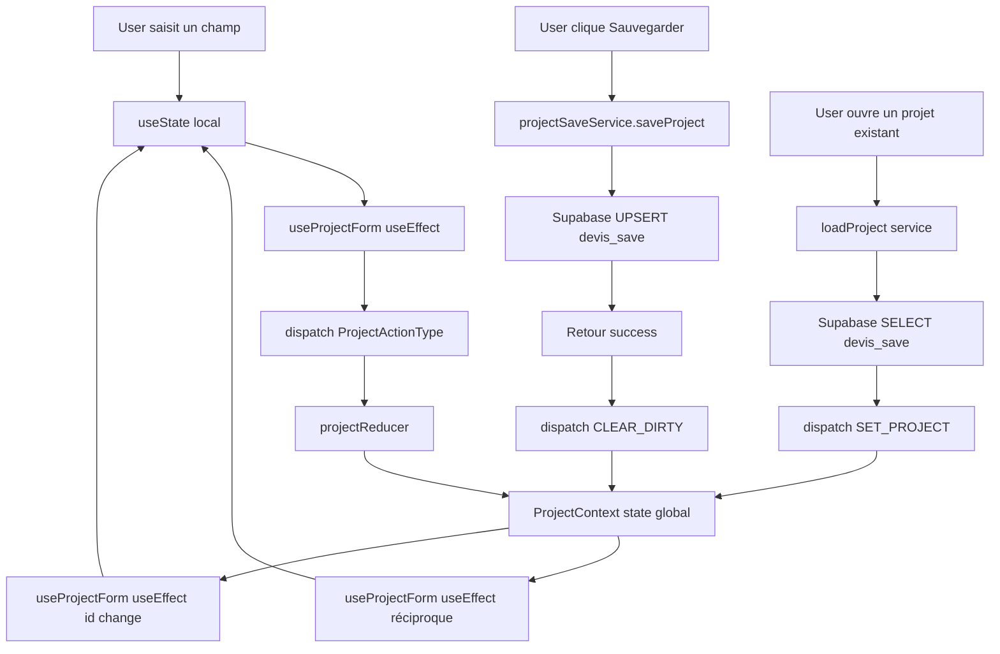

# Documentation Page "Informations du Projet"

## Vue d'ensemble

La page **"Informations du Projet"** (`src/pages/Projet.tsx`) est le point d'entrée pour créer ou modifier un devis. Elle collecte toutes les informations nécessaires à la définition du projet avant de passer aux étapes suivantes (Bien, Travaux, Récapitulatif).

---

## Architecture et State Management

### Sources de données

1. **État Local (useState)** : États temporaires pour l'UI et les champs avant synchronisation
2. **État Global (ProjectContext)** : État partagé géré par `projectReducer` et accessible via `useProject()`
3. **Hook Personnalisé (useProjectForm)** : Synchronise les états locaux avec l'état global
4. **Base de Données** :
    - Table `companies` : Liste des sociétés
    - Table `clients` : Liste des clients
    - Table `client_types` : Types de clients (Particulier, Syndic, etc.)
    - Table `devis_save` : Enregistrement des projets/devis

### Flux de données

```
User Input → Local State → useProjectForm → ProjectContext (dispatch) → projectReducer → Global State
                                                                           ↓
                                                                    projectSaveService.ts
                                                                           ↓
                                                                    Supabase (devis_save)
```

---

## Structure d'agencement des champs

La page utilise une **Card** principale avec un **CardHeader** et **CardContent**. Les champs sont organisés en plusieurs sections :

### Section 1 : Grid Principal (2 colonnes)
**Ligne 348-577**
```tsx
<div className="grid grid-cols-1 md:grid-cols-2 gap-4">
```

#### 1. Société (Company) - Colonne 1, Ligne 1
- **Type** : `Select` (dropdown)
- **ID** : `company`
- **Source de données** :
    - Fetched via `useCompanies()` hook depuis la table `companies`
    - Filtrée par `user_id` (utilisateur connecté peut voir ses sociétés + admin voit tout)
- **État local** : `selectedCompanyId` (string, UUID)
- **Valeur par défaut** : `'c949dd6d-52e8-41c4-99f8-6e84bf4695b9'` (société par défaut)
- **Enregistrement** :
    - Dispatch vers ProjectContext via `ProjectActionType.SET_PROJECT`
    - Stocké dans `projectState.company_id`
- **Options affichées** : `companies.map(company => company.name)`
- **Actions** :
    - Bouton "+ Ajouter Société" ouvre `CreateCompanyModal`
    - Après création, la nouvelle société est automatiquement sélectionnée

#### 2. Statut du devis - Colonne 2, Ligne 1
- **Type** : `Checkbox` avec Label dynamique
- **ID** : `devis-accepted`
- **État local** : `isAccepted` (boolean)
- **Source de données** : Synchronisé avec `globalProjectState.status`
    - Si `status === 'Accepté'` → checkbox cochée
    - Si `status === 'Brouillon'` → checkbox décochée
- **Enregistrement** :
    - Dispatch via `ProjectActionType.UPDATE_STATUS`
    - Stocké dans `projectState.status` (type: `devis_status_enum`)
- **Valeurs possibles** :
    - ✅ Coché = "Accepté"
    - ❌ Décoché = "Brouillon"
- **Impact sur autres champs** : Active/désactive les champs "Référence Bon de Commande" et "Date de confirmation"

#### 3. Type de client - Colonne 1, Ligne 2
- **Type** : `Select` (dropdown)
- **ID** : `clientType`
- **Source de données** :
    - Fetched via `useClients()` hook depuis la table `client_types`
    - Option supplémentaire "Tous les types" ajoutée manuellement
- **État local** : `selectedClientTypeId` (string, UUID ou 'all')
- **Valeur par défaut** : `'all'`
- **Enregistrement** :
    - **N'est PAS enregistré dans le projet** (filtre UI uniquement)
    - Utilisé pour filtrer la liste des clients affichés
- **Comportement** :
    - Change automatiquement → réinitialise `selectedClientId` à vide
    - Filtre `filteredClients` pour afficher uniquement les clients du type sélectionné

#### 4. Référence Bon de Commande - Colonne 2, Ligne 2
- **Type** : `Input` (text)
- **ID** : `command-reference`
- **État local** : `commandReference` (string)
- **Source de données** : Synchronisé avec `globalProjectState.reference_bon_commande`
- **Enregistrement** :
    - Dispatch via `ProjectActionType.UPDATE_REFERENCE_BON_COMMANDE`
    - Stocké dans `projectState.reference_bon_commande` (nullable)
    - Enregistré dans la table `devis_save.reference_bon_commande`
- **Validation** :
    - ❌ **Désactivé** si `isAccepted === false`
    - ✅ **Activé** uniquement si le devis est accepté
- **Style conditionnel** :
    - Label et input en `text-muted-foreground` si désactivé
    - Background `bg-muted` si désactivé

#### 5. Client - Colonne 1, Ligne 3
- **Type** : `Select` (dropdown)
- **ID** : `client`
- **Source de données** :
    - Fetched via `useClients()` hook depuis la table `clients`
    - Filtrée par `filteredClients` (selon type de client sélectionné)
- **État local** : `selectedClientId` (string, UUID)
- **Enregistrement** :
    - Dispatch via `ProjectActionType.SET_PROJECT`
    - Stocké dans `projectState.client_id`
    - Enregistré dans la table `devis_save.client_id`
- **Options affichées** :
    - Format : `${client.nom} ${client.prenom}`.trim() ou 'Client sans nom'
- **Actions** :
    - Bouton "+ Créer Client" ouvre `CreateClientModal`
    - Après création, le nouveau client est automatiquement sélectionné

#### 6. Date de confirmation/acceptation - Colonne 2, Ligne 3
- **Type** : `Popover` avec `Calendar` (date picker)
- **ID** : `confirmation-date`
- **État local** : `confirmationDate` (Date | undefined)
- **Source de données** : Synchronisé avec `globalProjectState.date_acceptation`
- **Enregistrement** :
    - Dispatch via `ProjectActionType.UPDATE_DATE_ACCEPTATION`
    - Format : `'YYYY-MM-DD'` (string)
    - Stocké dans `projectState.date_acceptation`
    - Enregistré dans la table `devis_save.date_acceptation` (type: `date`)
- **Validation** :
    - ❌ **Désactivé** si `isAccepted === false`
    - ✅ **Activé** uniquement si le devis est accepté
- **Format d'affichage** : `format(date, "PPP", { locale: fr })` (ex: "15 mars 2025")

---

### Section 2 : Liste des clients (Grille 3 colonnes : 2 + 1)
**Ligne 579-601**
```tsx
<div className="grid grid-cols-1 md:grid-cols-3 gap-4 items-end">
```

#### 7. Liste/données des clients - Colonnes 1-2
- **Type** : `Textarea` (multiligne)
- **ID** : `clientDetails`
- **État local** : `clientDetails` (string, multiligne)
- **Source de données** : Synchronisé avec `projectState.project_data.metadata.clientsData`
- **Enregistrement** :
    - Dispatch via `ProjectActionType.UPDATE_METADATA`
    - Stocké dans `projectState.project_data.metadata.clientsData`
    - Enregistré dans `devis_save.project_data->metadata->clientsData` (jsonb)
- **Hauteur** : `min-h-[100px]`
- **Format de contenu** :
  ```
  Type de client
  Nom Prénom
  Adresse - Code postal Ville
  
  Type de client 2
  Nom Prénom
  ...
  ```
- **Fonction d'ajout** : `handleAddClient()` formate et ajoute automatiquement un client sélectionné

#### 8. Bouton Ajouter Client - Colonne 3
- **Type** : `Button`
- **Action** : `handleAddClient()`
- **État** : Désactivé si `!selectedClientId`
- **Comportement** :
    1. Récupère le client sélectionné depuis `clients` via `selectedClientId`
    2. Trouve son type de client depuis `clientTypes`
    3. Formate les informations :
       ```
       Type de client
       Nom Prénom
       Adresse - Code postal Ville
       ```
    4. Ajoute au `clientDetails` existant (ou crée la première entrée)
    5. Affiche un toast de confirmation

---

### Section 3 : Numéro et Date du devis (2 colonnes)
**Ligne 603-657**
```tsx
<div className="grid grid-cols-1 md:grid-cols-2 gap-4">
```

#### 9. Numéro du devis - Colonne 1
- **Type** : `Input` (text)
- **ID** : `quoteNumber`
- **État local** : `quoteNumber` (string)
- **Source de données** : Synchronisé avec `globalProjectState.devis_number`
- **Enregistrement** :
    - Dispatch via `ProjectActionType.UPDATE_DEVIS_NUMBER`
    - Stocké dans `projectState.devis_number`
    - Enregistré dans `devis_save.devis_number` (text, NOT NULL)
- **Format attendu** : `YYMM-N` (ex: "2501-1" pour janvier 2025, 1er devis)
- **Placeholder** : "DEV-2025-001"
- **Génération automatique** :
    - Bouton icône `Edit3` déclenche `handleGenerateQuoteNumber()`
    - **Algorithme** :
        1. Utilise la `date` sélectionnée dans le calendrier (pas la date actuelle)
        2. Extrait année (2 derniers chiffres) et mois : `YYMM`
        3. Query Supabase pour trouver le dernier numéro avec ce préfixe
        4. Incrémente le compteur
        5. Format final : `YYMM-N`
    - **Exemple** : Si date = 15/01/2025 et dernier = "2501-3", génère "2501-4"

#### 10. Date du devis - Colonne 2
- **Type** : `Popover` avec `Calendar` (date picker)
- **ID** : `quoteDate`
- **État local** : `date` (Date | null)
- **Source de données** : Synchronisé avec `globalProjectState.devis_date`
- **Enregistrement** :
    - Dispatch via `ProjectActionType.SET_PROJECT`
    - Format : `format(date, 'yyyy-MM-dd')` (string)
    - Stocké dans `projectState.devis_date`
    - Enregistré dans `devis_save.devis_date` (date, NOT NULL, DEFAULT: CURRENT_DATE)
- **Valeur par défaut** : `new Date()` (date actuelle)
- **Format d'affichage** : `format(date, "PPP", { locale: fr })` (ex: "15 mars 2025")
- **Importance** : Cette date est utilisée pour générer le numéro de devis !

---

### Section 4 : Nom du projet (pleine largeur)
**Ligne 659-678**

#### 11. Nom du projet
- **Type** : `Input` (text)
- **ID** : `projectName`
- **État local** : `projectName` (string)
- **Source de données** : Synchronisé avec `globalProjectState.project_name`
- **Enregistrement** :
    - Dispatch via `ProjectActionType.UPDATE_PROJECT_NAME`
    - Stocké dans `projectState.project_name`
    - Enregistré dans `devis_save.project_name` (text, NOT NULL)
- **Génération automatique** :
    - Bouton "Générer Nom" déclenche `handleGenerateProjectName()`
    - **Algorithme** :
        1. Vérifie si `quoteNumber` existe, sinon génère un nouveau numéro
        2. Extrait le nom du client depuis la **ligne 2** de `clientDetails`
        3. Limite le nom du client à 30 caractères (+ "..." si tronqué)
        4. Extrait la **1ère ligne** de `projectDescription` ou "Projet en cours"
        5. Limite la description à 100 caractères (+ "..." si tronqué)
        6. **Format final** : `"Devis n° {quoteNumber} - {clientName} - {description}"`
    - **Exemple** : "Devis n° 2501-4 - Jean Dupont - Rénovation appartement..."

---

### Section 5 : Description du projet (pleine largeur)
**Ligne 680-690**

#### 12. Description du projet
- **Type** : `Textarea` (multiligne)
- **ID** : `projectDescription`
- **Label** : "Description du projet (1ère ligne pour le Nom du projet)"
- **État local** : `projectDescription` (string, multiligne)
- **Source de données** : Synchronisé avec `projectState.project_data.metadata.descriptionProjet`
- **Enregistrement** :
    - Dispatch via `ProjectActionType.UPDATE_METADATA`
    - Stocké dans `projectState.project_data.metadata.descriptionProjet`
    - Enregistré dans `devis_save.project_data->metadata->descriptionProjet` (jsonb)
- **Hauteur** : `min-h-[100px]`
- **Placeholder** : "Description détaillée du projet..."
- **Usage spécial** : La **1ère ligne** est utilisée pour la génération automatique du nom du projet

---

### Section 6 : Adresse et Occupants (2 colonnes)
**Ligne 692-713**
```tsx
<div className="grid grid-cols-1 md:grid-cols-2 gap-4">
```

#### 13. Adresse du chantier - Colonne 1
- **Type** : `Input` (text)
- **ID** : `address`
- **État local** : `address` (string)
- **Source de données** : Synchronisé avec `projectState.project_data.metadata.adresseChantier`
- **Enregistrement** :
    - Dispatch via `ProjectActionType.UPDATE_METADATA`
    - Stocké dans `projectState.project_data.metadata.adresseChantier`
    - Enregistré dans `devis_save.project_data->metadata->adresseChantier` (jsonb)
- **Placeholder** : "15 rue du Commerce, 75015 Paris"

#### 14. Occupants/Bénéficiaires - Colonne 2
- **Type** : `Input` (text)
- **ID** : `occupants`
- **État local** : `occupants` (string)
- **Source de données** : Synchronisé avec `projectState.project_data.metadata.occupant`
- **Enregistrement** :
    - Dispatch via `ProjectActionType.UPDATE_METADATA`
    - Stocké dans `projectState.project_data.metadata.occupant`
    - Enregistré dans `devis_save.project_data->metadata->occupant` (jsonb)
- **Placeholder** : "Jean Dupont et sa famille"

---

### Section 7 : Informations complémentaires (pleine largeur)
**Ligne 715-725**

#### 15. Informations complémentaires
- **Type** : `Textarea` (multiligne)
- **ID** : `additionalInfo`
- **État local** : `additionalInfo` (string, multiligne)
- **Source de données** : Synchronisé avec `projectState.project_data.metadata.infoComplementaire`
- **Enregistrement** :
    - Dispatch via `ProjectActionType.UPDATE_METADATA`
    - Stocké dans `projectState.project_data.metadata.infoComplementaire`
    - Enregistré dans `devis_save.project_data->metadata->infoComplementaire` (jsonb)
- **Hauteur** : `min-h-[100px]`
- **Placeholder** : "Autres informations sur le projet..."

---

## Composants Modaux

### CreateCompanyModal
- **Ligne 729-734**
- **Props** :
    - `isOpen` : `isCreateCompanyModalOpen` (boolean)
    - `onClose` : Ferme le modal
    - `onCompanyCreated` : Callback avec `companyId` (string)
- **Comportement** :
    1. Crée une nouvelle société dans la table `companies`
    2. Refresh la liste via `refreshCompanies()`
    3. Sélectionne automatiquement la nouvelle société
    4. Affiche un toast de confirmation

### CreateClientModal
- **Ligne 736-742**
- **Props** :
    - `isOpen` : `isCreateClientModalOpen` (boolean)
    - `onClose` : Ferme le modal
    - `onClientCreated` : Callback avec `clientId` (string)
    - `clientTypes` : Liste des types de clients pour le formulaire
- **Comportement** :
    1. Crée un nouveau client dans la table `clients`
    2. Refresh la liste via `refreshClients()`
    3. Sélectionne automatiquement le nouveau client
    4. Affiche un toast de confirmation

---

## Mapping complet : UI → Base de données

| Champ UI | État Local | État Global (ProjectContext) | Table BDD | Colonne BDD | Type BDD | Nullable | Notes |
|----------|-----------|------------------------------|-----------|-------------|----------|----------|-------|
| **Société** | `selectedCompanyId` | `projectState.company_id` | `devis_save` | `company_id` | `uuid` | No | FK vers `companies.id` |
| **Statut du devis** | `isAccepted` | `projectState.status` | `devis_save` | `status` | `devis_status_enum` | No | "Brouillon" ou "Accepté" |
| **Type de client** | `selectedClientTypeId` | ❌ Non enregistré | ❌ | ❌ | ❌ | ❌ | Filtre UI uniquement |
| **Référence Bon de Commande** | `commandReference` | `projectState.reference_bon_commande` | `devis_save` | `reference_bon_commande` | `text` | Yes | Actif si accepté |
| **Client** | `selectedClientId` | `projectState.client_id` | `devis_save` | `client_id` | `uuid` | No | FK vers `clients.id` |
| **Date confirmation** | `confirmationDate` | `projectState.date_acceptation` | `devis_save` | `date_acceptation` | `date` | Yes | Actif si accepté |
| **Liste des clients** | `clientDetails` | `projectState.project_data.metadata.clientsData` | `devis_save` | `project_data->metadata->clientsData` | `jsonb` | No | Texte multiligne formaté |
| **Numéro du devis** | `quoteNumber` | `projectState.devis_number` | `devis_save` | `devis_number` | `text` | No | Format: YYMM-N |
| **Date du devis** | `date` | `projectState.devis_date` | `devis_save` | `devis_date` | `date` | No | Default: CURRENT_DATE |
| **Nom du projet** | `projectName` | `projectState.project_name` | `devis_save` | `project_name` | `text` | No | Peut être généré auto |
| **Description** | `projectDescription` | `projectState.project_data.metadata.descriptionProjet` | `devis_save` | `project_data->metadata->descriptionProjet` | `jsonb` | No | 1ère ligne pour nom projet |
| **Adresse chantier** | `address` | `projectState.project_data.metadata.adresseChantier` | `devis_save` | `project_data->metadata->adresseChantier` | `jsonb` | No | |
| **Occupants** | `occupants` | `projectState.project_data.metadata.occupant` | `devis_save` | `project_data->metadata->occupant` | `jsonb` | No | |
| **Infos complémentaires** | `additionalInfo` | `projectState.project_data.metadata.infoComplementaire` | `devis_save` | `project_data->metadata->infoComplementaire` | `jsonb` | No | |

---

## Hook useProjectForm : Synchronisation bidirectionnelle

Le hook `useProjectForm` (`src/hooks/useProjectForm.tsx`) gère la synchronisation entre les états locaux et l'état global :

### Synchronisation État Local → État Global

Chaque champ dispose d'un `useEffect` qui dispatch vers le `ProjectContext` :

```tsx
// Exemple : Société
useEffect(() => {
  if (selectedCompanyId) {
    dispatch({ type: ProjectActionType.SET_DIRTY }); // Marque le projet comme modifié
    const updatedProject = { ...projectState, company_id: selectedCompanyId };
    dispatch({ type: ProjectActionType.SET_PROJECT, payload: updatedProject });
  }
}, [selectedCompanyId, dispatch]);
```

### Synchronisation État Global → État Local

Un `useEffect` principal réinitialise tous les champs locaux quand le `projectState.id` change :

```tsx
useEffect(() => {
  setSelectedCompanyId(projectState.company_id || defaultCompanyId);
  setSelectedClientId(projectState.client_id || '');
  setQuoteNumber(projectState.devis_number || '');
  // ... tous les autres champs
}, [projectState.id]);
```

**Déclenchement** : Quand un nouveau projet est chargé (changement d'ID), tous les champs se mettent à jour automatiquement.

---

## Enregistrement en Base de Données

L'enregistrement final se fait via le service `projectSaveService.ts` :

### Fonction : `saveProject(project: ProjectState)`

**Fichier** : `src/services/projectSaveService.ts`

**Méthode** : UPSERT (INSERT ou UPDATE selon l'existence de `project.id`)

**Processus** :
1. Récupère le `user_id` de la session Supabase
2. Calcule automatiquement `total_ht` depuis les travaux
3. Mappe `ProjectState` → structure `DevisSave` pour la BDD
4. Exécute l'UPSERT sur la table `devis_save`
5. Retourne l'enregistrement créé/mis à jour

**Mapping ProjectState → devis_save** :
```typescript
const devisSaveData = {
  id: project.id || undefined, // Génère un UUID si nouveau
  user_id: userId,
  company_id: project.company_id,
  client_id: project.client_id,
  project_name: project.project_name,
  devis_number: project.devis_number,
  devis_date: project.devis_date,
  status: project.status,
  reference_bon_commande: project.reference_bon_commande || null,
  date_acceptation: project.date_acceptation || null,
  total_ht: totalHT, // Calculé automatiquement
  project_data: project.project_data, // Tout le JSONB
  created_at: project.created_at || new Date().toISOString(),
  updated_at: new Date().toISOString(),
};
```

---

## Validations et Comportements Conditionnels

### 1. Désactivation conditionnelle (Statut Accepté)

Certains champs sont **désactivés** si le devis n'est **pas accepté** :

| Champ | Condition d'activation | Comportement si désactivé |
|-------|----------------------|---------------------------|
| **Référence Bon de Commande** | `isAccepted === true` | Input disabled + bg-muted + text-muted |
| **Date de confirmation** | `isAccepted === true` | Bouton disabled + Popover non ouvert |

**Code** :
```tsx
disabled={!isAccepted}
className={!isAccepted ? "bg-muted text-muted-foreground cursor-not-allowed" : ""}
```

### 2. Filtrage dynamique (Type de client)

Le champ "Client" affiche uniquement les clients du type sélectionné :

```tsx
const filteredClients = React.useMemo(() => {
  if (selectedClientTypeId === 'all' || !selectedClientTypeId) return clients;
  return clients.filter(client => client.client_type_id === selectedClientTypeId);
}, [clients, selectedClientTypeId]);
```

**Réinitialisation** : Changer le type de client → `setSelectedClientId('')` (vide la sélection)

### 3. États de chargement

Chaque Select affiche un loader pendant le chargement des données :

```tsx
{isLoadingCompanies ? (
  <div className="flex items-center">
    <Loader className="mr-2 h-4 w-4 animate-spin" />
    <span>Chargement...</span>
  </div>
) : (
  <SelectValue placeholder="Sélectionner une société" />
)}
```

### 4. Gestion des erreurs

Si une erreur survient lors du fetch :
- Border rouge sur le Select : `errorCompanies && "border-red-500"`
- Message d'erreur en dessous : `<p className="text-sm text-red-500">Erreur lors du chargement</p>`

---

## Hooks Utilisés

| Hook | Source | Rôle |
|------|--------|------|
| `useAuthSession()` | `@/hooks/useAuthSession` | Récupère la session utilisateur (user_id) |
| `useProject()` | `@/hooks/useProject` | Accès au ProjectContext (state + dispatch) |
| `useProjectForm()` | `@/hooks/useProjectForm` | Synchronisation des champs avec l'état global |
| `useCompanies()` | `@/hooks/useReferenceData` | Fetch des sociétés depuis `companies` |
| `useClients()` | `@/hooks/useReferenceData` | Fetch des clients et types de clients |
| `useToast()` | `@/hooks/use-toast` | Affichage des notifications |

---

## Fonctions Importantes

### handleGenerateQuoteNumber()

**Lignes 201-258**

**Rôle** : Génère un numéro de devis unique selon le format `YYMM-N`

**Algorithme** :
1. Utilise la `date` sélectionnée (ou date actuelle si null)
2. Extrait année (2 derniers chiffres) et mois : `prefix = YYMM`
3. Query Supabase :
   ```sql
   SELECT devis_number FROM devis_save 
   WHERE devis_number LIKE 'YYMM-%' 
   ORDER BY devis_number DESC LIMIT 1
   ```
4. Parse le dernier numéro (ex: "2501-3" → 3)
5. Incrémente : `nextNumber = lastNumber + 1`
6. Format final : `${prefix}-${nextNumber}` (ex: "2501-4")
7. Dispatch vers ProjectContext
8. Affiche un toast de confirmation

**Gestion d'erreur** : Toast variant="destructive" si erreur Supabase

---

### handleGenerateProjectName()

**Lignes 260-323**

**Rôle** : Génère automatiquement un nom de projet selon le format :
```
"Devis n° {quoteNumber} - {clientName} - {description}"
```

**Algorithme** :
1. **Vérifier quoteNumber** :
    - Si vide → Appelle `handleGenerateQuoteNumber()` d'abord
2. **Extraire le nom du client** :
    - Parse `clientDetails` (ligne 2 après split par `\n`)
    - Fallback : Client par défaut (ID hardcodé) si vide
    - Limite : 30 caractères max (+ "..." si tronqué)
3. **Extraire la description** :
    - Prend la **1ère ligne** de `projectDescription`
    - Fallback : "Projet en cours"
    - Limite : 100 caractères max (+ "..." si tronqué)
4. **Concaténation** : `Devis n° ${quoteNumber} - ${clientName} - ${description}`
5. Dispatch vers ProjectContext
6. Affiche un toast de confirmation

**Exemple de résultat** :
```
"Devis n° 2501-4 - Jean Dupont - Rénovation complète appartement..."
```

---

### handleAddClient()

**Lignes 153-199**

**Rôle** : Ajoute les informations du client sélectionné dans le textarea "Liste des clients"

**Algorithme** :
1. **Validations** :
    - Toast erreur si `!selectedClientId`
    - Toast erreur si client introuvable dans la liste
2. **Récupération des données** :
    - Trouve le client dans `clients` via `selectedClientId`
    - Trouve son type via `clientTypes` et `client.client_type_id`
3. **Formatage** :
   ```
   {clientTypeName}
   {nom} {prenom}
   {adresse} - {code_postal} {ville}
   ```
4. **Ajout** :
    - Si `clientDetails` est vide : Première entrée
    - Sinon : Ajoute avec 2 lignes vides avant (`\n\n`)
5. **Mise à jour** : `setClientDetails(formattedClientInfo)`
6. Affiche un toast de confirmation

**Exemple de résultat dans le textarea** :
```
Particulier
Jean Dupont
15 rue du Commerce - 75015 Paris

Syndic
Copropriété Les Jardins
23 avenue des Lilas - 75020 Paris
```

---

### handleCompanyCreated(companyId: string)

**Lignes 125-137**

**Rôle** : Callback après création d'une nouvelle société

**Actions** :
1. `await refreshCompanies()` : Recharge la liste depuis Supabase
2. `setSelectedCompanyId(companyId)` : Sélectionne automatiquement la nouvelle société
3. Dispatch vers ProjectContext (via useEffect de `selectedCompanyId`)
4. Affiche un toast de confirmation

---

### handleClientCreated(clientId: string)

**Lignes 139-151**

**Rôle** : Callback après création d'un nouveau client

**Actions** :
1. `await refreshClients()` : Recharge la liste depuis Supabase
2. `setSelectedClientId(clientId)` : Sélectionne automatiquement le nouveau client
3. Dispatch vers ProjectContext (via useEffect de `selectedClientId`)
4. Affiche un toast de confirmation

---

## Dépendances et Types

### Types TypeScript

**Fichier** : `src/types/project.ts`

```typescript
// Interface principale pour l'état du projet
interface ProjectState {
  id?: string;
  user_id?: string;
  company_id: string;
  client_id: string;
  project_name: string;
  devis_number: string;
  devis_date: string; // Format: 'YYYY-MM-DD'
  status: 'Brouillon' | 'Accepté' | 'Refusé' | 'En attente';
  reference_bon_commande?: string | null;
  date_acceptation?: string | null; // Format: 'YYYY-MM-DD'
  total_ht: number;
  project_data: ProjectData;
  isDirty: boolean; // UI state
  lastSaved?: string; // ISO timestamp
  created_at?: string;
  updated_at?: string;
}

// Métadonnées du projet
interface Metadata {
  descriptionProjet: string;
  clientsData: string; // Multiligne, formaté
  adresseChantier: string;
  occupant: string;
  infoComplementaire: string;
}

// Structure complète des données du projet
interface ProjectData {
  metadata: Metadata;
  property: Property;
  designations: Designation[];
  travaux: Travail[];
}
```

### Enum PostgreSQL : devis_status_enum

**Valeurs possibles** :
- `'Brouillon'` (par défaut)
- `'Accepté'`
- `'Refusé'`
- `'En attente'`

---

## Responsive Design

### Breakpoints

- **Mobile** (`< md`) : 1 colonne
- **Tablet/Desktop** (`>= md`) : 2 colonnes (ou 3 pour liste clients)

### Classes utilisées

```tsx
<div className="grid grid-cols-1 md:grid-cols-2 gap-4">
```

**Résultat** :
- Mobile : Tous les champs empilés verticalement
- Desktop : Grille 2 colonnes avec espacement de 4 (1rem)

---

## Points d'Attention et Bonnes Pratiques

### 1. Synchronisation avec Clara (IA Assistant)

Le hook `useAiSignals` peut mettre à jour le ProjectContext via des signaux `contextUpdate`.

**Exemple** : Clara peut remplir automatiquement le champ "Description du projet" après analyse d'un document.

**Flux** : `Clara → AiSignal → useAiSignals → ProjectContext dispatch → useProjectForm → UI update`

### 2. Gestion de l'état "dirty"

Le flag `isDirty` est automatiquement géré :
- ✅ **Set à true** : Dès qu'un champ est modifié (dispatch `SET_DIRTY`)
- ❌ **Reset à false** : Après sauvegarde réussie (via `projectSaveService.saveProject()`)

**Usage** : Pour afficher un avertissement avant de quitter la page si modifications non sauvegardées

### 3. Race Conditions

Le composant attend que la session soit chargée avant de rendre :

```tsx
const { session, loading: authLoading } = useAuthSession();
```

**Protection** : Évite les erreurs de `user_id` undefined lors des queries Supabase

### 4. Valeurs par défaut

- **Société** : ID hardcodé `'c949dd6d-52e8-41c4-99f8-6e84bf4695b9'`
- **Date du devis** : `new Date()` (date actuelle)
- **Statut** : `'Brouillon'`
- **Type de client** : `'all'` (tous les types)

**Localisation** : Dans `useProjectForm` et `initialProjectState` (`projectReducer.ts`)

### 5. Format des dates

**Important** : Toujours utiliser le format `'YYYY-MM-DD'` pour l'enregistrement en BDD.

**Conversion** :
```typescript
// Date object → String pour BDD
format(date, 'yyyy-MM-dd')

// String BDD → Date object pour UI
new Date(projectState.devis_date)
```

---

## Diagramme de flux



---

## Fichiers Liés

| Fichier | Rôle |
|---------|------|
| `src/pages/Projet.tsx` | Composant principal de la page |
| `src/hooks/useProjectForm.tsx` | Synchronisation état local ↔ global |
| `src/hooks/useProject.ts` | Accès au ProjectContext |
| `src/contexts/ProjectContext.tsx` | Définition du Context React |
| `src/features/project/reducers/projectReducer.ts` | Reducer pour les actions du projet |
| `src/types/project.ts` | Types TypeScript (ProjectState, Metadata, etc.) |
| `src/services/projectSaveService.ts` | Service d'enregistrement en BDD |
| `src/hooks/useReferenceData.ts` | Fetch des données référentielles (clients, sociétés, types) |
| `src/components/client/CreateClientModal.tsx` | Modal de création de client |
| `src/components/company/CreateCompanyModal.tsx` | Modal de création de société |

---

## Conclusion

La page **"Informations du Projet"** est le cœur de l'application de devis. Elle collecte **15 champs** essentiels, gère des **validations conditionnelles** (statut accepté), et s'intègre parfaitement avec le système de **state management global** via le `ProjectContext`.

**Points forts** :
✅ Synchronisation bidirectionnelle automatique (useProjectForm)
✅ Génération automatique de numéros et noms de projets
✅ Modals intégrés pour créer des clients/sociétés à la volée
✅ Gestion des états de chargement et d'erreur
✅ Responsive design avec grilles Tailwind
✅ Enregistrement JSONB pour métadonnées flexibles

**Amélioration future possible** :
- Validation des champs obligatoires avant passage à la page suivante
- Autocomplete pour l'adresse du chantier (API Adresse Gouv)
- Historique des modifications (changelog)